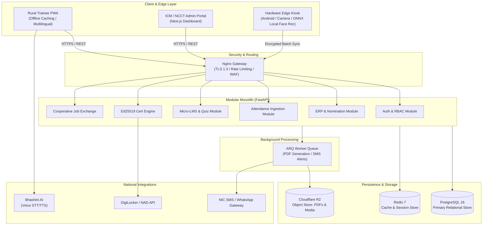
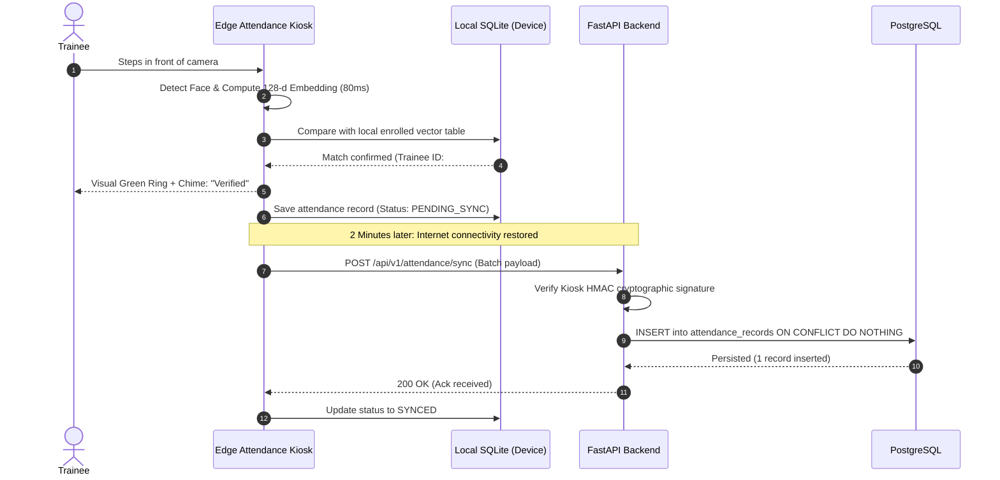
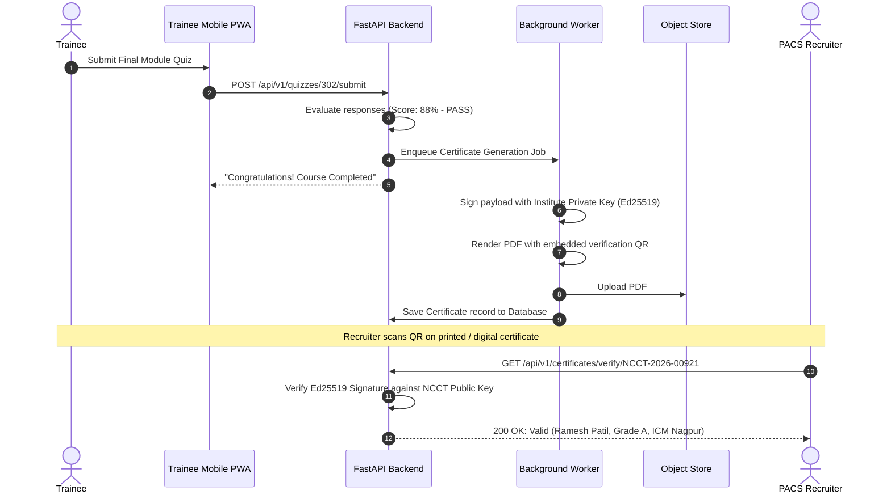

# System Architecture Design: AI & LMS - Enabled Cooperative Capacity Building, ERP & Employment Ecosystem (NCCT)
**Problem Statement ID:** 26087  
**Organization:** Ministry of Cooperation | National Council for Cooperative Training (NCCT)  
**Author:** Principal Software Architect & CTO  
**Status:** Approved for MVP Build  

---

## 1. Executive Summary

The National Council for Cooperative Training (NCCT), operating through VAMNICOM, 5 RICMs, and 14 ICMs, trains hundreds of thousands of cooperative personnel, Primary Agricultural Credit Societies (PACS) members, Self-Help Groups (SHGs), dairy cooperative workers, and rural youth annually. 

Today, this ecosystem suffers from **fragmentation and manual friction**: training institutes track nominations on spreadsheets, physical attendance is prone to proxy fraud, certification is paper-bound, and trained rural candidates are abandoned into an employment void with no direct linkage to hiring cooperatives.

This document outlines a **CTO-level, MVP-first architecture** for the **"Sahakar-Setu" Unified Platform**:
- A **Single Modular Monolith** backend (FastAPI + PostgreSQL) delivering ERP training lifecycle management and a lightweight LMS.
- A **Hardware Edge Attendance Subsystem** utilizing offline-resilient Android kiosks / tablet devices running edge-based anti-spoof Face Recognition + Geo-fenced Dynamic QR codes.
- An **Offline-First PWA** optimized for low-bandwidth 2G/3G rural environments with audio-first multilingual micro-learning.
- A **Direct Cooperative Job Exchange** connecting certified trainees with PACS, District Central Cooperative Banks (DCCBs), and dairy unions without middleman agencies.
- A **Multilingual Voice-First Career Guidance Bot** powered by lightweight open models (Indic-BERT / quantized Llama/Mistral via cached retrieval) to guide semi-literate rural youth.

By prioritizing a **Modular Monolith over Microservices**, standard relational schema over distributed DBs, and edge-first caching over heavy cloud processing, this system achieves **zero cloud bloat, sub-second latency on 3G networks, and an operational cost under \$120/month during MVP**.

---

## 2. Problem Understanding

### 2.1 What is happening?
NCCT's apex institutes (VAMNICOM, Pune) and regional/state institutes (RICMs/ICMs) administer training across India. Currently:
1. **Nomination Chaos:** PACS and cooperative societies send nomination physical letters or disconnected emails. Staff manually type lists into local files.
2. **Ghost Attendance & Allowance Leakage:** Stipends, lodging, and travel allowances are disbursed based on paper attendance registers, vulnerable to proxy signatures and attendance inflation.
3. **No Verifiable Credentialing:** Trainees receive paper certificates susceptible to forgery and impossible for hiring banks or societies to verify in real-time.
4. **The "Train and Forget" Abyss:** Post-training, there is zero digital ledger linking certified candidates with vacant positions across 100,000+ newly computerized PACS, dairy unions, or federations.
5. **Campus Logistics Overhead:** Hostel room allotment, mess management, classroom scheduling, and faculty honorariums are managed via paper logs and whiteboard schedules.

### 2.2 Who is affected?
- **Rural Trainees & Youth:** Cannot prove credential authenticity; lack job discovery channels.
- **PACS & Cooperatives:** Face severe shortages of skilled, certified accountants and managers despite thousands being trained every year.
- **ICM/RICM Institute Directors & Faculty:** Overburdened with administrative paperwork rather than pedagogy.
- **Ministry of Cooperation & NCCT HQ:** Lack real-time visibility into fund utilization, national capacity metrics, or syllabus effectiveness.

### 2.3 Measurable Impact
- **Administrative overhead:** ~45% of faculty and coordinator time spent on data reconciliation.
- **Placement rate visibility:** <5% post-training outcomes tracked centrally.
- **Certificate verification latency:** 2 to 4 weeks via postal/email back-checks.

### 2.4 Constraints
- **Connectivity:** Tier-3/rural institute campuses and village PACS often suffer from intermittent internet connectivity.
- **Digital Literacy:** Rural youth and women SHG members have high smartphone penetration but low textual literacy (require voice/regional language UI).
- **Budget:** Strict public-sector fiscal discipline; recurring cloud subscriptions must be minimized.

---

## 3. Problem Validation (Challenging Assumptions)

| Premise / Assumption | Critical Challenge | Verdict & Solution |
| :--- | :--- | :--- |
| **"Do we need Microservices?"** | Only 20 apex institutes and ~250k annual trainees. High network latency between distributed microservices will kill performance and multiply DevOps costs by 5x. | **REJECTED.** Build a clean **Modular Monolith**. Single deployable unit, shared database with strict schema isolation. |
| **"Do we need Blockchain for Certificates?"** | Storing hashes on public blockchains costs gas fees; private blockchains require validator node maintenance that NCCT IT staff cannot maintain. | **REJECTED.** Asymmetric Cryptography (Ed25519 digitally signed QR codes) + Open Badges JSON-LD metadata verifiable offline without blockchain. DigiLocker API integration. |
| **"Do we need Cloud Face Recognition (AWS Rekognition)?"** | Cloud video streaming from remote training centers incurs massive bandwidth costs and fails when internet drops during morning 9:00 AM rush. | **REJECTED.** **Edge-First Hardware:** Lightweight Mobile/Tablet Kiosk using MobileFaceNet/InsightFace (ONNX Runtime, 1.2MB model) running on-device in under 80ms, syncing attendance batches to server asynchronously. |
| **"Do we need an Enterprise LMS like full Moodle / Canvas?"** | Moodle is bloated with 1,000+ unused PHP tables, heavy server requirements, and terrible offline mobile performance. | **REJECTED.** Build an in-engine **Micro-LMS**: simple module-lesson-quiz hierarchy with SCORM/xAPI packet support and offline PWA caching via CacheStorage API. |
| **"Is an AI Chatbot actually needed?"** | Text LLMs fail rural users who cannot type English/Hindi prompts. | **REFINED.** An **Audio-First Vernacular Bot** using Bhashini/Whisper STT + Fast local RAG over NCCT course manuals, responding via Indic TTS. |

---

## 4. Root Cause Analysis (5 Whys)

### Root Cause 1: Low Post-Training Employment
- *Problem:* Trainees graduate from ICMs but fail to secure cooperative jobs.
- *Why?* Recruiters (PACS, DCCBs, FPOs) don't know who graduated or what skills they have.
- *Why?* There is no shared repository; candidate records stay locked in local paper registers of individual ICMs.
- *Why?* Each institute functions as a standalone operational silo with zero centralized data pipeline.
- *Root Cause:* **Absence of a unified, verified digital credential exchange bridging institute output directly with cooperative hiring quotas.**

### Root Cause 2: Administrative Friction & Ghost Attendance
- *Problem:* Discrepancies in attendance, hostel occupancy, and stipend payouts.
- *Why?* Paper sign-in sheets allow friends to sign proxies; physical roll calls waste classroom time.
- *Why?* Institutes lack automated, spoof-proof, offline-capable verification hardware at hostel and classroom entry points.
- *Root Cause:* **Reliance on human trust verification rather than edge-computed biometric cryptographic proof.**

---

## 5. MVP Scope (Disciplined Prioritization)

```
+-----------------------------------------------------------------------+
| MUST HAVE (MVP Core - Week 1 to 6)                                   |
| - Unified User Authentication (RBAC for Trainee, Faculty, Admin, Recruiter) |
| - ERP Training Lifecycle: Programme creation, Nominations, Allotment  |
| - Edge Attendance Subsystem: Tablet App with Face Rec & Geo-fenced QR |
| - Micro-LMS: SCORM/Video lessons, Quiz, Auto-grading                 |
| - Cryptographically Signed Digital Certificates with QR verification  |
| - Basic Cooperative Job Board (Recruiter posts, Trainee 1-click apply)|
+-----------------------------------------------------------------------+
                                   |
+-----------------------------------------------------------------------+
| SHOULD HAVE (Post-MVP - Week 7 to 10)                                 |
| - Multilingual Audio/Text Career Guidance Bot (Bhashini API)          |
| - Campus ERP: Hostel bed allocation and Mess meal tracking             |
| - Direct DigiLocker National Academy Depository (NAD) Sync            |
| - Automated SMS/WhatsApp notifications via Gov SMS Gateway (NIC)      |
+-----------------------------------------------------------------------+
                                   |
+-----------------------------------------------------------------------+
| NICE TO HAVE (Future Expansion)                                       |
| - AI-based Proctoring for remote self-paced exams                     |
| - Advanced Trainee Dropout Predictive Analytics                       |
| - IoT Smart-card / RFID integration for physical library entry        |
+-----------------------------------------------------------------------+
                                   |
+-----------------------------------------------------------------------+
| EXCLUDED (Scope Killers - Do NOT Build)                              |
| - Blockchain tokenized credentials                                    |
| - Metaverse / VR Cooperative Classrooms                               |
| - Custom Video Streaming CDN (Embed YouTube Unlisted / Cloudflare R2) |
+-----------------------------------------------------------------------+
```

---

## 6. Functional Requirements

### 6.1 Trainee / Rural Youth Requirements
- **FR-T01: Zero-Friction Registration:** Mobile number + OTP registration; profile completion with caste, education, PACS affiliation, and Aadhaar-masked ID.
- **FR-T02: Multilingual Catalog:** Browse physical and online courses offered by VAMNICOM/RICMs/ICMs in English, Hindi, and regional languages.
- **FR-T03: E-Learning Experience:** Stream or download micro-lessons; take interactive end-of-module multiple-choice assessments.
- **FR-T04: Digital Identity & Wallet:** Access verifiable digital training card with dynamic QR code and downloadable PDF certificate.
- **FR-T05: Job Application:** View verified job postings from PACS, FPOs, and Dairy Cooperatives; apply with one click using certified transcript.

### 6.2 Training Institute & Faculty Requirements
- **FR-F01: Programme Scheduling:** Create training calendars, define batch sizes, assign faculty, and set seat quotas (PACS sponsored vs Direct Rural Youth).
- **FR-F02: Nomination Processing:** Approve or reject bulk nominations sent by cooperative societies.
- **FR-F03: Classroom Attendance Monitoring:** View real-time roll-call feeds synced from the edge attendance hardware.
- **FR-F04: Assessment & Grading:** Publish question banks, grade practical evaluations, and trigger one-click batch certificate generation.
- **FR-F05: Campus Resource Management:** Manage hostel room assignments, mess coupons, and compute daily faculty travel/honorarium claims.

### 6.3 Cooperative Employer Requirements
- **FR-E01: Job & Apprenticeship Posting:** Post vacancies with specific skill, language, and district requirements.
- **FR-E02: Candidate Search & Filter:** Filter certified alumni by institute, course grade, district, and cooperative domain (PACS Banking, Dairy, Horticulture).
- **FR-E03: Instant Credential Verification:** Scan trainee certificate QR code to receive instant cryptographic validation of score and institute authenticity.

### 6.4 NCCT HQ & Ministry of Cooperation Admin Requirements
- **FR-A01: National Capacity Dashboard:** Real-time visibility into active batches, seats occupied, gender diversity, and budget utilization across all 20 institutes.
- **FR-A02: Curriculum Standardization:** Push standardized syllabus templates to all regional institutes.
- **FR-A03: Employment Analytics:** Track employment conversion ratios post-certification across states.

---

## 7. Non-Functional Requirements (NFRs)

| Metric | Target Specification | Architectural Strategy |
| :--- | :--- | :--- |
| **Response Latency** | P95 < 250ms for API calls | Redis caching for course catalogs; PostgreSQL indexed queries; server-side rendering for critical paths. |
| **Edge Attendance Latency** | < 100ms per face verification | Local ONNX MobileFaceNet inference running directly on low-cost tablet/phone CPU. |
| **Offline Resilience** | 100% attendance & syllabus caching | SQLite storage on Edge/Kiosk app; background sync when network is restored. |
| **Network Footprint** | Page load < 1.2MB; Video adaptive bitrate | Client-side asset compression; WebP images; AV1/H.264 video transcoding via Cloudflare Stream or R2. |
| **Availability** | 99.9% uptime during operational hours | Automated health checks, multi-zone DB backup, stateless container recovery. |
| **Security & Privacy** | OWASP Top 10 compliance, DPDP Act 2023 | Aadhaar masking (only last 4 digits stored); encrypted biometric embeddings (no raw photos stored); TLS 1.3. |
| **Concurrent Users** | 5,000 active concurrent trainees | Async I/O (FastAPI + Uvicorn) + Connection Pooling (SQLAlchemy NullPool/QueuePool with PgBouncer). |

---

## 8. Stakeholders & Actors

```
+--------------------------------------------------------------------------------+
| ACTOR HIERARCHY & ACCESS SCOPE                                                 |
+--------------------------------------------------------------------------------+
| [Ministry / NCCT HQ]  ---> Macro Governance, Budget, Inter-Institute Analytics |
|        |                                                                       |
| [Institute Director]  ---> Institute-level Operations, Batch Approval, Funds   |
|        |                                                                       |
| [Program Coordinator] ---> Timetables, Faculty Honorarium, Hostel/Mess Alloc.  |
|        |                                                                       |
| [Faculty / Trainer]   ---> Attendance verification, LMS Content, Grading       |
|        |                                                                       |
| [Trainee / Youth]     ---> Learning Modules, Quizzes, Digital Certificate, Jobs|
|                                                                                |
| [External Actors]                                                              |
| - Cooperative Employer / PACS Secretary (Post jobs, verify alumni)            |
| - Edge Attendance Kiosk Device (Autonomous IoT/Android Client)                 |
| - Gov Portals (DigiLocker, Bhashini AI Gateway, NIC SMS Gateway)              |
+--------------------------------------------------------------------------------+
```

---

## 9. End-to-End User Journeys

### 9.1 Trainee Journey (From Rural Village to Employed Cooperative Staff)
```
[Trainee discovers course via WhatsApp/SMS link]
        |
        v
[Registers via Phone OTP on mobile PWA -> Selects Marathi/Hindi language]
        |
        v
[PACS Secretary approves nomination via 1-click tokenized SMS link]
        |
        v
[Trainee arrives at ICM Nagpur -> Scans Face at Entrance Tablet Kiosk]
        |
        v
[System marks Attendance -> Allocates Hostel Room 204 automatically]
        |
        v
[Attends classroom lectures + completes LMS mobile quizzes in evening]
        |
        v
[Passes final assessment -> Instant tamper-proof QR Certificate generated]
        |
        v
[Local DCCB Bank posts vacancy for "PACS Junior Accountant"]
        |
        v
[Trainee applies with 1-tap -> Bank scans QR -> Verifies & hires candidate]
```

### 9.2 Edge Attendance Flow (Zero-Network Resilient)
```
[Trainee stands before Tablet Kiosk at ICM Classroom]
        |
        v
[Camera captures frame -> Face Detected -> Extracts 128-dim Embedding Vector]
        |
        v
[Compares against local SQLite offline vector cache using Cosine Distance]
        |
  +-----+-----+
  | Match > 0.85?
  v           v
[YES]       [NO / Spoof Check Failed]
  |           |
  |           +--> [Prompt: Enter 4-digit PIN or Show Dynamic App QR]
  v
[Display "Verified: Ramesh Patil" on screen with green chime]
  |
[Store record in local SQLite queue with timestamp + device tamper token]
  |
[Background sync worker polls ping to central API every 60 seconds]
  |
[Network active? -> POST /api/v1/attendance/batch -> Flush queue]
```

---

## 10. Data Flow Architecture

```
[Edge Kiosk / Trainee PWA]
          |
          | HTTPS (JSON / REST + JWT Bearer)
          v
+-------------------------------------------------------------------+
| REVERSE PROXY & GATEWAY (NGINX / Caddy)                          |
| - TLS 1.3 Termination, Gzip/Brotli compression                   |
| - Rate Limiting (100 req/min per IP, Burst: 20)                   |
| - WAF / Header sanitization                                       |
+-------------------------------------------------------------------+
          |
          v
+-------------------------------------------------------------------+
| FASTAPI BACKEND (MODULAR MONOLITH CORE)                           |
|                                                                   |
| [Auth & RBAC Middleware] -> Validates JWT & Institute Tenant Scope|
|        |                                                          |
|        +---> [Nomination & Batch Service]                         |
|        +---> [Edge Attendance Ingestion & Anti-Fraud Service]     |
|        +---> [LMS & SCORM Progress Tracker Service]               |
|        +---> [Cryptographic Certificate Engine (Ed25519)]        |
|        +---> [Cooperative Job Matcher Engine]                    |
+-------------------------------------------------------------------+
          |                                  |
          v                                  v
+------------------------+      +-----------------------------------+
| PRIMARY DATABASE       |      | ASYNC TASK WORKER (Celery/ARQ)    |
| (PostgreSQL 16)        |      | - PDF Certificate Rendering       |
| - ACID Trans Management|      | - WhatsApp/SMS Notification Queue |
| - Row-Level Security   |      | - Bhashini Audio Translation Jobs |
| - Full-Text Search     |      +-----------------------------------+
+------------------------+                   |
          ^                                  v
          |                     +-----------------------------------+
+------------------------+      | OBJECT STORAGE (Cloudflare R2/S3) |
| IN-MEMORY CACHE        |      | - Signed PDF Certificates         |
| (Redis 7)              |      | - Lesson Audio/Video micro-assets |
| - Session tokens       |      | - Course Handouts & Slides        |
| - Batch enrollment stats|     +-----------------------------------+
+------------------------+
```

---

## 11. Architecture Decision: Why Modular Monolith?

### The Evaluation Matrix

| Architectural Pattern | Operational Cost | DevOps Overhead | Latency | Suitability for NCCT | Decision |
| :--- | :--- | :--- | :--- | :--- | :--- |
| **Microservices** | Very High (\$600+/mo across multiple clusters) | Extreme (Kubernetes, Service Mesh, Kafka, Tracing) | High (Network hops between 8 services) | Over-engineered disaster for a 20-institute system | **REJECTED** |
| **Serverless (Pure Lambda)** | Medium (Cold starts hurt face sync) | High vendor lock-in (AWS IAM, API Gateways) | Variable (Cold starts 1-3s) | Impractical for offline sync & stateful batch tasks | **REJECTED** |
| **Modular Monolith** | **Lowest (\$40 - \$80/mo on 1 VPS)** | **Minimal (1 Docker compose file, zero orchestration bloat)** | **Sub-millisecond (In-process function calls)** | **Perfect match for maintainability, simplicity & speed** | **SELECTED** |

### Internal Modularity Enforcement
The codebase is structured in isolated domain packages under `app/modules/`:
- `auth/` (Users, Roles, Institute scoping)
- `erp/` (Nominations, Batches, Logistics, Hostels)
- `attendance/` (Edge sync, Face embeddings, Geo-QR)
- `lms/` (Courses, Lessons, Quizzes, Grades)
- `credentials/` (Certificate generation, Signing, Verification)
- `jobs/` (Employer postings, Trainee applications)

*Rule:* Modules interact only through defined service interfaces, never by querying another module's internal repository directly. This allows seamless extraction into independent microservices in the future *only if* national scaling warrants it.

---

## 12. Technology Stack Selection with Justification

```
+----------------------------------------------------------------------------------------------------+
| TIER             | TECHNOLOGY            | JUSTIFICATION                  | ALTERNATIVE REJECTED    |
+------------------+-----------------------+--------------------------------+-------------------------+
| Frontend         | Next.js 14 (PWA Mode) | Server-side rendering for slow | React SPA (slower on 3G)|
|                  | + Tailwind CSS        | devices; offline caching.      | Flutter Web (heavy size)|
+------------------+-----------------------+--------------------------------+-------------------------+
| Backend API      | Python (FastAPI)      | Blazing async performance,     | Node.js / Express       |
|                  |                       | native typing, seamless AI/ML  | (poor native ML tools   |
|                  |                       | library integrations.          | for face verification)  |
+------------------+-----------------------+--------------------------------+-------------------------+
| Database         | PostgreSQL 16         | Gold-standard ACID reliability,| MongoDB (weak for strict|
|                  |                       | relational integrity, JSONB.   | accounting & logistics) |
+------------------+-----------------------+--------------------------------+-------------------------+
| Cache & Queues   | Redis 7               | Blazing fast in-memory store;  | RabbitMQ / Kafka        |
|                  | + ARQ (Async Worker)  | lightweight queue without JVM. | (immense RAM overhead)  |
+------------------+-----------------------+--------------------------------+-------------------------+
| Edge Hardware    | Android Tablet/Phone  | Affordable hardware (Rs 8,000);| Dedicated Biometric     |
| Client           | + ONNX MobileFaceNet  | runs offline edge face rec in  | Fingerprint scanners    |
|                  |                       | < 80ms without cloud latency.  | (driver hell & wear)    |
+------------------+-----------------------+--------------------------------+-------------------------+
| Object Storage   | Cloudflare R2 / MinIO | S3-compatible, zero egress     | AWS S3 (punitive egress |
|                  |                       | bandwidth fees for video/PDFs. | costs for public files) |
+------------------+-----------------------+--------------------------------+-------------------------+
| Cryptography     | PyNaCl (Ed25519)      | Compact 64-byte signature;     | RSA-4096 (keys too big  |
|                  |                       | fits cleanly into a 2D QR code.| for small printed certs)|
+------------------+-----------------------+--------------------------------+-------------------------+
| Multilingual AI  | Bhashini Open API +   | Gov-funded Indic speech APIs;  | OpenAI GPT-4o           |
|                  | Local Indic-BERT RAG  | zero per-token cost burden.    | (prohibitive recurring \$)|
+----------------------------------------------------------------------------------------------------+
```

---

## 13. Database Design

```
+----------------------------------------------------------------------------------------+
|                                    ENTITY RELATIONSHIP                                  |
+----------------------------------------------------------------------------------------+
|  [Institutes] 1 ----< N [Batches] 1 ----< N [Nominations] >---- 1 [Users]              |
|        |                     |                                     |                   |
|        |                     +----< N [AttendanceRecords] >--------+                   |
|        |                     |                                     |                   |
|        +----< N [HostelRooms]+----< N [Certificates] >-------------+                   |
|                                                                    |                   |
|  [Courses] 1 ----< N [Modules] 1 ----< N [Lessons]                 |                   |
|      |                                                             |                   |
|      +----------< N [JobPostings] 1 ----< N [JobApplications] >----+                   |
+----------------------------------------------------------------------------------------+
```

### Core Normalized Schema (PostgreSQL DDL Extracts)

```sql
-- 1. Institutes Table (VAMNICOM, RICMs, ICMs)
CREATE TABLE institutes (
    id UUID PRIMARY KEY DEFAULT gen_random_uuid(),
    code VARCHAR(20) UNIQUE NOT NULL, -- e.g., 'ICM-LUCKNOW'
    name VARCHAR(255) NOT NULL,
    state VARCHAR(100) NOT NULL,
    district VARCHAR(100) NOT NULL,
    is_active BOOLEAN DEFAULT TRUE,
    created_at TIMESTAMPTZ DEFAULT CURRENT_TIMESTAMP
);

-- 2. Users Table
CREATE TABLE users (
    id UUID PRIMARY KEY DEFAULT gen_random_uuid(),
    phone VARCHAR(15) UNIQUE NOT NULL,
    full_name VARCHAR(255) NOT NULL,
    gender VARCHAR(20),
    role VARCHAR(30) NOT NULL, -- 'TRAINEE', 'FACULTY', 'COORDINATOR', 'DIRECTOR', 'EMPLOYER'
    institute_id UUID REFERENCES institutes(id), -- Nullable for independent candidates
    aadhaar_masked VARCHAR(8), -- Stores only last 4 digits (e.g. 'XXXX1234')
    face_embedding FLOAT8[128], -- 128-d normalized vector representation
    preferred_language VARCHAR(10) DEFAULT 'hi',
    created_at TIMESTAMPTZ DEFAULT CURRENT_TIMESTAMP
);

-- 3. Batches / Training Programmes Table
CREATE TABLE batches (
    id UUID PRIMARY KEY DEFAULT gen_random_uuid(),
    institute_id UUID NOT NULL REFERENCES institutes(id),
    title VARCHAR(255) NOT NULL,
    course_category VARCHAR(100) NOT NULL, -- 'PACS Computerization', 'Dairy Management'
    start_date DATE NOT NULL,
    end_date DATE NOT NULL,
    capacity INT NOT NULL DEFAULT 40,
    status VARCHAR(30) DEFAULT 'PLANNED', -- 'PLANNED', 'ONGOING', 'COMPLETED'
    created_at TIMESTAMPTZ DEFAULT CURRENT_TIMESTAMP
);

-- 4. Nominations Table
CREATE TABLE nominations (
    id UUID PRIMARY KEY DEFAULT gen_random_uuid(),
    batch_id UUID NOT NULL REFERENCES batches(id) ON DELETE CASCADE,
    trainee_id UUID NOT NULL REFERENCES users(id),
    sponsoring_org VARCHAR(255), -- e.g., 'Kisan PACS Barabanki'
    nomination_status VARCHAR(30) DEFAULT 'PENDING', -- 'PENDING', 'APPROVED', 'REJECTED'
    hostel_required BOOLEAN DEFAULT FALSE,
    hostel_room_no VARCHAR(20),
    created_at TIMESTAMPTZ DEFAULT CURRENT_TIMESTAMP,
    UNIQUE(batch_id, trainee_id)
);

-- 5. Attendance Records Table (High Velocity)
CREATE TABLE attendance_records (
    id UUID PRIMARY KEY DEFAULT gen_random_uuid(),
    batch_id UUID NOT NULL REFERENCES batches(id),
    trainee_id UUID NOT NULL REFERENCES users(id),
    device_id VARCHAR(50) NOT NULL,
    check_in TIMESTAMPTZ NOT NULL,
    verification_mode VARCHAR(20) NOT NULL, -- 'FACE_EDGE', 'DYNAMIC_QR', 'MANUAL_OVERRIDE'
    confidence_score FLOAT, -- Match confidence (e.g. 0.94)
    is_synced BOOLEAN DEFAULT TRUE,
    created_at TIMESTAMPTZ DEFAULT CURRENT_TIMESTAMP
);
CREATE INDEX idx_attendance_batch_date ON attendance_records(batch_id, check_in);

-- 6. Verifiable Certificates Table
CREATE TABLE certificates (
    id UUID PRIMARY KEY DEFAULT gen_random_uuid(),
    certificate_number VARCHAR(50) UNIQUE NOT NULL, -- 'NCCT-2026-ICML-00921'
    trainee_id UUID NOT NULL REFERENCES users(id),
    batch_id UUID NOT NULL REFERENCES batches(id),
    grade VARCHAR(10) NOT NULL,
    signature_hash VARCHAR(255) NOT NULL, -- Ed25519 digital signature
    pdf_url VARCHAR(500) NOT NULL,
    issued_date DATE DEFAULT CURRENT_DATE
);

-- 7. Job Postings & Applications Table
CREATE TABLE job_postings (
    id UUID PRIMARY KEY DEFAULT gen_random_uuid(),
    employer_id UUID NOT NULL REFERENCES users(id),
    title VARCHAR(255) NOT NULL,
    organization_name VARCHAR(255) NOT NULL,
    district VARCHAR(100) NOT NULL,
    required_course_category VARCHAR(100),
    vacancies INT DEFAULT 1,
    status VARCHAR(20) DEFAULT 'OPEN',
    created_at TIMESTAMPTZ DEFAULT CURRENT_TIMESTAMP
);

CREATE TABLE job_applications (
    id UUID PRIMARY KEY DEFAULT gen_random_uuid(),
    job_id UUID NOT NULL REFERENCES job_postings(id) ON DELETE CASCADE,
    trainee_id UUID NOT NULL REFERENCES users(id),
    certificate_id UUID REFERENCES certificates(id),
    application_status VARCHAR(30) DEFAULT 'SUBMITTED', -- 'SUBMITTED', 'SHORTLISTED', 'HIRED'
    applied_at TIMESTAMPTZ DEFAULT CURRENT_TIMESTAMP,
    UNIQUE(job_id, trainee_id)
);
```

---

## 14. API Design (Pragmatic REST)

All endpoints conform to `/api/v1/` prefix with standard HTTP response codes and bearer token authorization.

### 14.1 Authentication & Profile
- `POST /api/v1/auth/otp/send`: Request 6-digit OTP for given phone number.
- `POST /api/v1/auth/otp/verify`: Exchange OTP for JWT Access Token (15-min life) + Refresh Token (30-day life).
- `POST /api/v1/trainee/face-enroll`: Upload 3 clear portrait frames; backend extracts and stores 128-d embedding; discards raw images.

### 14.2 ERP & Batch Management
- `POST /api/v1/institutes/{id}/batches`: Create a new training programme.
- `GET /api/v1/batches/{id}/nominations`: List registered participants with approval status.
- `POST /api/v1/nominations/bulk-upload`: Upload CSV list of PACS candidates with auto-SMS invitation.
- `POST /api/v1/batches/{id}/hostel-allocate`: Auto-assign available beds to outstation trainees.

### 14.3 Edge Hardware Attendance Ingestion
- `POST /api/v1/attendance/sync`: Ingest offline attendance batches from tablet kiosks.
  - **Payload:**
    ```json
    {
      "device_id": "KIOSK-ICML-ROOM-3",
      "sync_timestamp": "2026-09-27T09:15:00Z",
      "records": [
        {
          "trainee_id": "550e8400-e29b-41d4-a716-446655440000",
          "batch_id": "9b1deb4d-3b7d-4bad-9bdd-2b0d7b3dcb6d",
          "timestamp": "2026-09-27T08:58:21Z",
          "mode": "FACE_EDGE",
          "confidence": 0.92,
          "device_signature": "e7b0c3..."
        }
      ]
    }
    ```
  - **Response:** `200 OK` `{ "ingested": 1, "duplicates_skipped": 0 }`

### 14.4 LMS & Micro-Learning
- `GET /api/v1/courses/{id}/modules`: Retrieve offline-cacheable lesson manifest.
- `POST /api/v1/quizzes/{id}/submit`: Submit quiz responses and receive instant computed score.

### 14.5 Digital Credentials & Verification
- `POST /api/v1/certificates/issue-batch`: Generate cryptographically signed certificates for qualified trainees.
- `GET /api/v1/certificates/verify/{certificate_number}`: Public endpoint (no auth needed) validating Ed25519 signature and returning student name, course, institute, and validity.

---

## 15. System Components

```
+--------------------------------------------------------------------------------+
| CLIENT TIER                                                                    |
|  - Rural Trainee PWA (Next.js 14, Offline Service Workers, Multilingual i18n)   |
|  - Institute Admin Portal (DataGrid, Batch Manager, Hostel Allocation UI)      |
|  - Edge Attendance Kiosk (Android Native / Flutter with ONNX MobileFaceNet)    |
+--------------------------------------------------------------------------------+
                                       |
                                       v
+--------------------------------------------------------------------------------+
| GATEWAY & APPLICATION TIER (Single Linux VPS / Container Host)                 |
|  - Nginx Reverse Proxy (SSL, Gzip, DDOS Rate Limiting)                         |
|  - FastAPI Application Container (Uvicorn ASGI workers)                        |
|    * Auth & User Directory                                                    |
|    * ERP Training Lifecycle Manager                                            |
|    * LMS SCORM/Quiz Engine                                                     |
|    * Cryptographic Token & Cert Signer (PyNaCl)                                |
|  - ARQ Background Queue Worker (Certificate rendering, bulk notifications)     |
+--------------------------------------------------------------------------------+
                                       |
                                       v
+--------------------------------------------------------------------------------+
| PERSISTENCE & CACHE TIER                                                       |
|  - PostgreSQL 16 (Primary relational datastore with strict constraints)        |
|  - Redis 7 (Tokens, rate limits, catalog cache, worker message broker)         |
|  - Local / Cloudflare R2 Bucket (PDFs, static course audio/video)              |
+--------------------------------------------------------------------------------+
```

---

## 16. Mermaid Architecture Diagram



---

## 17. Mermaid Sequence Diagrams

### 17.1 Morning Edge Attendance & Offline Sync Sequence


### 17.2 Exam Completion, Instant Certification & QR Verification


---

## 18. Security Architecture & Threat Mitigation

```
+-----------------------------------------------------------------------------------------+
| THREAT VECTOR         | SEVERITY | MITIGATION IN SAHAKAR-SETU ARCHITECTURE              |
+-----------------------+----------+------------------------------------------------------+
| Biometric Theft /     | CRITICAL | Raw facial photos are NEVER saved. Face frames are   |
| Privacy Leak          |          | converted to 128-d float embeddings in device RAM    |
|                       |          | and raw frames are immediately wiped from memory.    |
+-----------------------+----------+------------------------------------------------------+
| Proxy Attendance /    | HIGH     | Edge Kiosk utilizes Depth/Blink Liveness detection   |
| Photo Spoofing        |          | (anti-spoof ONNX classifier). Photos of photos fail. |
+-----------------------+----------+------------------------------------------------------+
| Fake Certificate      | CRITICAL | Certificates carry asymmetric Ed25519 signatures.    |
| Generation            |          | Public key is globally verifiable. Modifying even 1  |
|                       |          | character in the cert invalidates the cryptographic  |
|                       |          | checksum.                                            |
+-----------------------+----------+------------------------------------------------------+
| SQL Injection /       | HIGH     | SQLAlchemy 2.0 parameterized queries exclusively.    |
| Data Corruption       |          | Zero dynamic string concatenation in SQL queries.    |
+-----------------------+----------+------------------------------------------------------+
| Bulk Scraping of      | MEDIUM   | Strict IP rate limiting (100 req/min) via Nginx;     |
| Trainee Phone Data    |          | Phone numbers masked in public recruiter searches.   |
+-----------------------------------------------------------------------------------------+
```

---

## 19. Scalability Roadmap: From MVP to National Deployment

```
[Phase 1: Pilot MVP (0 - 5,000 Trainees)]
  * 1 Ubuntu 24.04 Cloud VPS (8GB RAM, 4 vCPU) -> ~$40/month
  * FastAPI + PostgreSQL + Redis on single host via Docker Compose
  * 20 Tablet Kiosks across 2 pilot institutes (e.g., VAMNICOM + ICM Lucknow)
  * Target: Validate edge attendance, batch workflow & certificate verification.
                        |
                        v
[Phase 2: Regional Rollout (5,000 - 50,000 Trainees)]
  * Managed PostgreSQL (DigitalOcean / AWS RDS db.t4g.medium) with read replica
  * 2 Application Droplets behind Load Balancer
  * 100 Tablet Kiosks across all 19 RICMs/ICMs
  * Static media offloaded to Cloudflare R2 CDN
                        |
                        v
[Phase 3: National Apex Ecosystem (100,000 - 500,000 Trainees)]
  * Containerized cluster (Nomad or lightweight EKS)
  * PgBouncer connection pooling supporting 5,000 concurrent writes
  * Multi-region database replication for disaster recovery
  * Direct integration with Ministry of Cooperation's National Cooperative Database
```

---

## 20. Cost Estimation (Zero-Bloat MVP Budget)

### 20.1 Monthly Infrastructure Cost (First 6 Months)
- **Primary Cloud Server (8GB RAM, 4 vCPU, 160GB NVMe SSD - Hetzner / DigitalOcean):** \$42.00 / month
- **Managed Redis (1GB Instance):** \$15.00 / month
- **Object Storage (Cloudflare R2 - 50GB storage, zero egress fees):** \$1.50 / month
- **Transactional SMS / WhatsApp Notifications (Gov NIC Gateway / Msg91 fallback):** \$30.00 / month
- **Domain & SSL Certificates (Let's Encrypt / Cloudflare Free):** \$0.00
- **Total Recurring Infrastructure:** **~\$88.50 / month (~₹7,400 INR / month)**

### 20.2 Hardware Costs (Pilot Deployment)
- **10x Android Tablets (8-inch, 3GB RAM, Front Camera, Rugged Casing):** ₹9,000 × 10 = ₹90,000 (\$1,080)
- **10x Heavy-duty Adjustable Desktop / Wall Stands:** ₹1,500 × 10 = ₹15,000 (\$180)
- **Total Initial Hardware Capex:** **₹1,05,000 INR (~$1,260 USD)**

---

## 21. Risks and Mitigations

| Category | Risk Description | Severity | Concrete Mitigation Strategy |
| :--- | :--- | :--- | :--- |
| **Technical** | Trainees cannot be identified due to lighting variation in old rural classrooms. | High | Edge software automatically triggers tablet screen white-fill flash when ambient illumination is below 20 lux; fallback to dynamic animated QR scan on trainee's personal phone. |
| **Operational** | Institute faculty resist digital adoption and continue paper registers. | High | System auto-generates mandatory TA/DA honorarium bills and Ministry attendance reports *only* from verified digital system records. |
| **Connectivity**| Complete internet outage for 3-5 days in remote training centers. | Medium | SQLite on edge kiosk buffers up to 30,000 attendance records locally; auto-syncs when tablet connects to faculty mobile hotspot. |
| **Regulatory** | Compliance with Digital Personal Data Protection (DPDP) Act 2023. | High | Strict parental/user consent modals; biometric raw data is never stored; full audit log of which employer viewed which candidate profile. |

---

## 22. Architectural Tradeoff Analysis

```
+---------------------------------------------------------------------------------------------------+
| DECISION                 | CHOSEN APPROACH             | SACRIFICED ALTERNATIVE      | RATIONALE  |
+--------------------------+-----------------------------+-----------------------------+------------+
| Attendance Biometrics    | Edge Face Rec (Tablet Kiosk)| Dedicated Optical Bio Device| Optical USB|
|                          |                             |                             | fingerprint|
|                          |                             |                             | sensors    |
|                          |                             |                             | fail on dry|
|                          |                             |                             | farmer skin|
+--------------------------+-----------------------------+-----------------------------+------------+
| LMS Content Delivery     | Micro-Lessons (Audio/Video  | Heavy SCORM 2004 3D LMS     | Low-end    |
|                          | + Quizzes in PWA)           | package engines             | phones     |
|                          |                             |                             | freeze on  |
|                          |                             |                             | heavy SCORM|
+--------------------------+-----------------------------+-----------------------------+------------+
| Database Architecture    | PostgreSQL + Foreign Keys   | NoSQL / MongoDB             | Financial  |
|                          |                             |                             | stipends & |
|                          |                             |                             | certificate|
|                          |                             |                             | uniqueness |
|                          |                             |                             | demand ACID|
+--------------------------+-----------------------------+-----------------------------+------------+
| Credentials Architecture | Asymmetric Ed25519 Signatures| Public Blockchain / Solidity| Zero gas   |
|                          |                             | Smart Contracts             | fees; zero |
|                          |                             |                             | dependency |
+---------------------------------------------------------------------------------------------------+
```

---

## 23. CTO Review (Self-Correction & Challenge)

> **CTO Devil's Advocate Audit:**
> 1. *Is the edge face recognition kiosk over-engineered?*  
> **Challenge:** "Why not just let trainees scan a QR code pasted on the wall?"  
> **Response:** Wall-printed static QR codes allow massive fraud: students photograph the QR code and WhatsApp it to friends sleeping in hostels to scan remotely. The Edge Kiosk or dynamic rolling OTP QR guarantees **physical physical presence**.
>
> 2. *Can anything be removed from this MVP?*  
> **Adjustment:** Remove complex hostel room 3D floorplan visualizers and mess kitchen inventory tracking from Phase 1. Replace with a simple bed allocation drop-down table. Keep the engineering team 100% focused on Nomination Flow, Edge Attendance, and Job Matching.
>
> 3. *Why not use Django instead of FastAPI?*  
> **Evaluation:** Django's built-in Admin is great, but FastAPI provides 4x higher async request throughput, native Pydantic typing, and trivial integration with Python's AI/ONNX ecosystem for biometric feature extraction.

---

## 24. Implementation Roadmap (Week-Wise MVP Plan)

```
[WEEK 1] Core Scaffold & Schema
  ├── Setup FastAPI modular monolith repository & PostgreSQL Docker
  ├── Implement RBAC Authentication (JWT + Phone OTP)
  └── Institute, Course, and Batch DB migrations

[WEEK 2] ERP Nomination & Lifecycle Flow
  ├── Institute Admin Batch creation UI
  ├── Trainee self-registration & PACS bulk nomination upload
  └── Automated nomination approval notifications via SMS

[WEEK 3] Hardware Edge Attendance Subsystem
  ├── Build Android Tablet App with ONNX MobileFaceNet engine
  ├── Offline SQLite storage & HMAC sync protocol
  └── Backend /api/v1/attendance/sync ingestion endpoint

[WEEK 4] Micro-LMS & Vernacular Assessment
  ├── PWA offline-first lesson reader & video streamer
  ├── Interactive Quiz module with auto-evaluation
  └── Multilingual Hindi/English UI switch

[WEEK 5] Verifiable Credentials & Job Exchange
  ├── Ed25519 cryptographic certificate generator & QR code stamper
  ├── Public certificate verification portal
  └── Cooperative Recruiter job posting & 1-click apply portal

[WEEK 6] Hardening, Pilot Deployment & Ministry Demo
  ├── Deploy to single production VPS with Nginx SSL & automated daily backups
  ├── Deploy 2 physical tablet kiosks at test institute
  └── End-to-end stress testing (Simulated 500 concurrent edge check-ins)
```

---

## 25. Future Enhancements

1. **National PACS ERP Seamless Handshake:** Direct API integration with the newly computerized Primary Agricultural Credit Societies ERP to auto-enroll newly appointed village society secretaries into mandatory certification.
2. **AI Vernacular Voice Tutor:** Interactive voice-based mock interviews in regional dialects (Bhojpuri, Marathi, Tamil, Bengali) to train rural candidates for cooperative bank cashier examinations.
3. **Smart Credit Card Badges (NFC):** Equipping trainees with low-cost NFC identity cards for automated hostel mess and library tap-and-go access.
