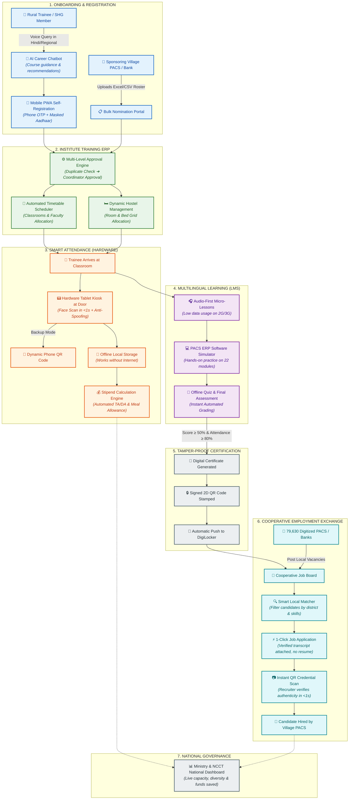

# SIH 2026 OFFICIAL PRESENTATION SLIDES (COPY-PASTE READY)
**Problem Statement ID:** 26087  
**Title:** AI & LMS - Enabled Cooperative Capacity Building, ERP & Employment Ecosystem  
**Target Ministry:** Ministry of Cooperation, Government of India  
**Target Organization:** National Council for Cooperative Training (NCCT)  
**Theme:** Smart Education | **Category:** Hardware | **Mode:** Software + Hardware  
*Optimized for Official 6-Slide 16:9 Presentation Format (Strict SIH Template)*

---

# SLIDE 1: TITLE PAGE

### [SLIDE METADATA]
* **Problem Statement ID:** 26087
* **Problem Statement Title:** AI & LMS - Enabled Cooperative Capacity Building, ERP & Employment Ecosystem
* **Theme:** Smart Education
* **Category:** Hardware (Proposed Mode: Software + Hardware)
* **Organization:** Ministry of Cooperation, Government of India
* **Department:** National Council for Cooperative Training (NCCT)
* **Team ID:** `[YOUR_TEAM_ID]`
* **Team Name:** `[YOUR_TEAM_NAME]`
* **Project Name:** **SAHAKAR-SETU (सहकार-सेतु)**
* **Tagline:** *Bridging Cooperative Training, Edge Biometrics, and Grassroots Rural Employment*

### [SLIDE 1 LAYOUT & VISUAL SPECIFICATION]
```
+----------------------------------------------------------------------------------------------------+
| [Team Logo / ID]                   MINISTRY OF COOPERATION                       [SIH 2026 Logo]   |
|                             National Council for Cooperative Training                              |
|                                                                                                    |
|                                         SAHAKAR-SETU                                               |
|                    Empowering 79,630 Multipurpose PACS Through Unified                             |
|                   Training ERP, Edge Biometric Attendance & Direct Hiring                          |
|                                                                                                    |
|   ┌───────────────────┬───────────────────┬───────────────────┬───────────────────┐                |
|   │ 1. TRAINING ERP   │ 2. EDGE HARDWARE  │ 3. VERNACULAR LMS │ 4. JOB EXCHANGE   │                |
|   │ 20 NCCT Institutes│ Android Kiosk     │ Offline PWA       │ Direct PACS Hiring│                |
|   │ Batch & Hostel    │ Local Face Match  │ Indic Voice AI    │ W3C QR Credentials│                |
|   │ Verified TA/DA    │ <80ms / Anti-Spoof│ 22 Languages      │ DigiLocker Sync   │                |
|   └───────────────────┴───────────────────┴───────────────────┴───────────────────┘                |
|                                                                                                    |
| PS ID: 26087  |  Theme: Smart Education  |  Category: Hardware (Software + Hardware)               |
| Team Name: [Your Team Name]              |  Team ID: [Your Team ID]                                |
+----------------------------------------------------------------------------------------------------+
```

---

# SLIDE 2: IDEA TITLE / PROPOSED SOLUTION & INNOVATION

### 1. THE PROBLEM WE ADDRESS (Four Failures, One Root Cause)
* **Context:** Despite **₹2,925.39 Cr invested in digitizing 79,630 PACS**, the **8+ lakh workforce** training ecosystem remains largely manual and fragmented across 20 NCCT institutes.
* **NO CENTRAL NERVOUS SYSTEM:** Paper-based registration and attendance create no central source of truth for learning, enrollments, or stipends.
* **PRESENCE WITHOUT PROOF:** Manual roll calls enable proxy attendance without reliable biometric verification.
* **REACH STOPS AT CAMPUS GATE:** Campus-only training excludes remote youth and SHGs lacking low-bandwidth, vernacular digital access.
* **CREDENTIAL NOBODY CAN TRUST:** Forged paper certificates and slow verification make skilled rural candidates difficult for digitized PACS to trust and hire.

---

### 2. WHAT THEY ASKED US TO BUILD (Official 9-Subsystem Scope)

#### Subsystem 1: Institution ERP Platform (Training Management)
* **Online Programme Registration & Nomination System:**
  * Self-registration for rural youth, farmers, and SHG members.
  * Bulk nomination portal for PACS, DCCBs, and dairy cooperatives to sponsor employees.
  * Multi-level approval workflow (Sponsoring Society → ICM Coordinator → Final Allotment).
* **Profile Management Engine:**
  * Trainee profile (Aadhaar-masked, education, caste, society affiliation, skills).
  * Institution profile (NCCT, VAMNICOM, 5 RICMs, 14 ICMs with campus capacity).
  * Faculty profile (subject expertise, availability, honorarium tracking).
* **Timetable & Scheduling Management:**
  * Automated batch calendar scheduling, classroom mapping, and lecture allocation.
* **Hostel Management System:**
  * Real-time hostel room and bed allocation for outstation trainees.
  * Check-in/check-out tracking and room occupancy reporting.
* **Logistics & Mess Management:**
  * Meal tracking and mess coupon issuance.
  * Travel allowance (TA) and daily allowance (DA) stipend calculation based on verified attendance.

#### Subsystem 2: Smart Digital Attendance (Hardware + Edge Software)
* **Hardware Kiosk / Device Client:**
  * A physical device (Android Tablet or Raspberry Pi 5 / RK3566 + Camera) to be mounted at classroom/hostel entrances.
* **On-Device Face Recognition:**
  * Local edge biometric verification (<100ms) to prevent ghost attendance and proxy sign-ins.
  * Anti-spoofing / liveness check (blocks photos or phone replay attacks).
* **Geo-fenced / Dynamic QR Code Fallback:**
  * Rotating dynamic TOTP QR code on the trainee’s phone for fast secondary check-in.
* **Offline-First Attendance Sync:**
  * Local on-device SQLite database that stores check-ins when village internet is down and auto-flushes when back online.

#### Subsystem 3: Interactive Multilingual LMS (E-Learning)
* **Multilingual Course Delivery:**
  * Bite-sized micro-learning modules translated into regional languages (Hindi, Marathi, Tamil, etc.).
* **Multimedia & Interactive Learning Tools:**
  * Video lectures, audio summaries, downloadable PDF handouts, and interactive practical guides for PACS accounting software.
* **Assessment & Quiz Engine:**
  * Pre-course baseline tests, end-of-module quizzes, and final examinations.
  * Automated instant grading and feedback.

#### Subsystem 4: Skill Certification Repository & Instant Verification
* **Automated Digital Certificate Generation:**
  * Instant certificate issuance upon passing the course with grade and institute details.
* **Tamper-Proof QR Code Verification:**
  * Cryptographically signed QR code (Ed25519) printed on the certificate.
* **Public Verification Portal:**
  * A zero-login web page where any bank manager or employer can scan the QR code to instantly verify authenticity.
* **Centralized Credential Repository:**
  * Permanent searchable digital archive of every certified trainee across all 20 institutes (compatible with DigiLocker).

#### Subsystem 5: Cooperative Employment Exchange & Recruiter Dashboard
* **Employer & Recruiter Portal:**
  * Dedicated login for PACS Secretaries, District Central Cooperative Banks (DCCBs), FPOs, and dairy federations.
  * Vacancy posting interface (specifying district, required certificate, salary).
* **Certified Talent Directory & Search:**
  * Employers can search and filter certified candidates by institute, batch year, test grade, and home district.
* **1-Click Application Workflow:**
  * Trainees can browse verified cooperative jobs and apply directly using their verified certificate transcript.

#### Subsystem 6: AI Career Counseling Chatbot
* **Vernacular Voice & Text Interaction:**
  * Chatbot accessible in regional languages (supporting voice inputs via speech-to-text).
* **Cooperative Career Guidance Engine:**
  * Answers trainee questions: "Which course should I take to become a PACS Accountant?", "What are the eligibility rules for DCCB clerk posts?", "How do I apply for the NCDC Sahakar Mitra internship?"
* **Course Recommendation Algorithm:**
  * Recommends upcoming training batches based on the user's educational background and interests.

#### Subsystem 7: Mobile-Friendly & Offline-Accessible Trainee Client
* **Progressive Web App (PWA) / Lightweight Mobile App:**
  * Designed to run smoothly on low-end budget smartphones ($70–$100 phones) over slow 2G/3G connections.
* **Offline Content Caching:**
  * Trainees can download lesson modules and quizzes when at the institute's Wi-Fi and review them offline at home.

#### Subsystem 8: Centralized Database & National Analytics Dashboard
* **Centralized Multi-Tenant Database:**
  * Single database serving NCCT HQ, 20 regional institutes, and thousands of PACS with strict role-based access control (RBAC).
* **Ministry & NCCT HQ Analytics Dashboard:**
  * Macro metrics: total trained by state/gender/caste, budget utilization, hostel occupancy rates, and post-training job placement rates.
* **Future Programme Outreach & Monitoring:**
  * Automated SMS/WhatsApp notifications informing alumni about advanced refresher courses or local job openings.

#### Subsystem 9: Physical Hardware Specifications
* **Edge Device:** Rugged 8-inch Android tablet or Raspberry Pi 4/5 board.
* **Optical Sensor:** Front-facing wide-angle HD camera module.
* **Mounting & Casing:** Tamper-resistant wall or desktop stand with physical keylock.
* **Power Safeguard:** Internal battery backup to withstand daily 2–4 hour rural power cuts.

#### Official Summary Checklist
| Subsystem | Key Deliverable | Mode |
| :--- | :--- | :--- |
| **1. Admin & ERP** | Batch scheduling, Nominations, Hostel & Mess management | Web Portal |
| **2. Attendance** | Face recognition kiosk + Dynamic QR scanner | **Hardware + Edge App** |
| **3. LMS** | Multilingual micro-learning + Quiz engine | Web PWA / Mobile |
| **4. Certificates** | QR-verifiable tamper-proof certificates + Central repository | Web Service |
| **5. Employment** | Recruiter job posting + 1-click candidate apply | Web Portal |
| **6. AI Counseling** | Multilingual voice/text career guidance chatbot | AI Assistant |
| **7. Analytics** | National capacity & placement dashboard for Ministry | Executive Dashboard |

---

# SLIDE 3: TECHNICAL APPROACH & SYSTEM ARCHITECTURE
*User-Centric Operational Flow with Rigorous Technical Engine Mapping*

---

### 1. USER-JOURNEY DRIVEN TECHNICAL ARCHITECTURE (Slide Flow Diagram)



```
┌──────────────────────────────────────────────────────────────────────────────────────────────────┐
│ STAGE 1: VILLAGE DISCOVERY & REGISTRATION                                                        │
│ 👤 User: Rural Youth / SHG | 📱 Client: Offline-First Next.js 14 PWA (<1.2MB)                    │
│ ⚙️ Technical Engine:                                                                             │
│ • AI4Bharat IndicWhisper (ASR) + IndicTrans2 + Indic-TTS Voice Gateway (22 Languages)           │
│ • PostgreSQL pg_trgm Fuzzy Dedup: Merges cross-institute candidate IDs on name + DOB + phone    │
└────────────────────────────────┬─────────────────────────────────────────────────────────────────┘
                                 │
                                 ▼ (Tokenized SMS Approval / Bulk Nomination Ingestion)
┌──────────────────────────────────────────────────────────────────────────────────────────────────┐
│ STAGE 2: TRAINING INSTITUTION ERP & LOGISTICS                                                    │
│ 👤 User: Institute Coordinator & Warden | 💻 Client: Next.js Admin DataGrid                     │
│ ⚙️ Technical Engine:                                                                             │
│ • Camunda BPMN State Machine: Automated Multi-Tier Approval (PACS ➔ Coordinator ➔ Seat Allotment)│
│ • Constraint Scheduling Engine: Conflict-free classroom, lab, and visiting faculty timetable     │
│ • Dynamic Bed Matrix: Deterministic room/bed allocation based on gender and batch dates          │
└────────────────────────────────┬─────────────────────────────────────────────────────────────────┘
                                 │
                                 ▼ (Trainee Steps in Front of Classroom Doorway)
┌──────────────────────────────────────────────────────────────────────────────────────────────────┐
│ STAGE 3: HARDWARE EDGE BIOMETRIC ATTENDANCE KIOSK                                                │
│ 👤 User: Trainee + Faculty | 📟 Client: 8" Android Tablet / Camera (Autonomous Edge Device)      │
│ ⚙️ Technical Engine:                                                                             │
│ • Quantized INT8 MobileFaceNet ONNX Runtime: Extracts 128-d vector in <80ms on ARM CPU           │
│ • MiniFASNet Silent Liveness: Real-time anti-spoofing; raw frame purged from RAM (DPDP 2023)    │
│ • Embedded SQLite Spooler: Buffers 50,000 logs offline; flushes via HMAC-SHA256 upon sync        │
│ • Stipend Integrity Rule Engine: TA/DA calculated strictly on biometric records; flags anomalies │
└────────────────────────────────┬─────────────────────────────────────────────────────────────────┘
                                 │
                                 ▼ (Evening Study & Practical Hands-on Practice)
┌──────────────────────────────────────────────────────────────────────────────────────────────────┐
│ STAGE 4: INTERACTIVE MULTILINGUAL LMS & PACS ERP SANDBOX                                         │
│ 👤 User: Trainee | 📱 Client: Client-Side Cached PWA (Serwist / Workbox)                         │
│ ⚙️ Technical Engine:                                                                             │
│ • Audio-First Engine: Meta MMS-TTS (<2MB/module) stored in IndexedDB for 2G/3G connectivity      │
│ • In-Browser Sandbox Simulator: Interactive simulation of 22 National PACS ERP modules          │
│ • Client-Side Quiz Evaluator: Randomizes questions; syncs ONLY integer score to save mobile data │
└────────────────────────────────┬─────────────────────────────────────────────────────────────────┘
                                 │
                                 ▼ (Pass Criteria Met: Attendance ≥80%, Exam ≥50%)
┌──────────────────────────────────────────────────────────────────────────────────────────────────┐
│ STAGE 5: ASYMMETRIC W3C CREDENTIAL ISSUANCE                                                      │
│ 👤 User: Certified Graduate + DigiLocker | 📄 Client: Digital / Physical Verifiable PDF          │
│ ⚙️ Technical Engine:                                                                             │
│ • Asymmetric Ed25519 Cryptography: Institute private key signs metadata into high-density 2D QR  │
│ • Dual-Push Pipeline: Saves record to PostgreSQL + pushes directly to DigiLocker / NAD API      │
│ • Zero-Login Public Verification: Cached public keys verify QR code in <15ms offline ($0 gas fee)│
└────────────────────────────────┬─────────────────────────────────────────────────────────────────┘
                                 │
                                 ▼ (Cooperative Hiring / Rural Placement)
┌──────────────────────────────────────────────────────────────────────────────────────────────────┐
│ STAGE 6: EXPLAINABLE TALENT-EMPLOYER MATCHING & NATIONAL GOVERNANCE                              │
│ 👤 User: 79,630 PACS Secretaries & Ministry HQ | 💻 Client: NCD Recruiter Portal & HQ Cockpit   │
│ ⚙️ Technical Engine:                                                                             │
│ • National Career Service (NCS) API Ingestion: Bidirectional vacancy & placement synchronization │
│ • Explainable Deterministic Ranker: Score = w1(Grade) + w2(Proximity) + w3(Recency) (Auditable) │
│ • 1-Click Verified Apply: Trainee binds cryptographically verified transcript with zero resumes  │
│ • Ministry Executive Cockpit: Real-time capacity, diversity, placement ROI, and fraud savings    │
└──────────────────────────────────────────────────────────────────────────────────────────────────┘
```

---

### 2. SLIDE 3 SUMMARY SPECIFICATIONS (Copy-Paste Text Cards)

* **Stage 1 (Discovery):** `PWA (<1.2MB)` + `IndicWhisper Voice ASR` + `pg_trgm Fuzzy Dedup`.
* **Stage 2 (ERP & Logistics):** `Camunda BPMN State Machine` + `Constraint Timetable Scheduler` + `Dynamic Bed Grid`.
* **Stage 3 (Edge Attendance):** `INT8 MobileFaceNet ONNX (<80ms)` + `MiniFASNet Liveness` + `SQLite Buffer (50k)` + `TA/DA Rule Engine`.
* **Stage 4 (Micro-LMS):** `Meta MMS-TTS Audio (<2MB)` + `IndexedDB Cache` + `PACS ERP 22-Module Simulator`.
* **Stage 5 (Credentials):** `Ed25519 Cryptographic QR` + `DigiLocker/NAD Push` + `Offline Verify (<15ms)`.
* **Stage 6 (Employment & HQ):** `NCS API Ingestion` + `Explainable Weighted Ranker` + `Real-Time Ministry Cockpit`.

---

### 3. COMPLETE MODULES & COMPONENTS GROUPED BY TECHNOLOGY PLATFORM
*Visual Artefact: [modules_grouped_by_tech.jpg](file:///d:/sih-26087/modules_grouped_by_tech.jpg) | [userflow_with_users.jpg](file:///d:/sih-26087/userflow_with_users.jpg)*

| Deployment Platform | Modules & Components | Key Features & Capabilities | Primary Users & Roles | Technology Stack |
| :--- | :--- | :--- | :--- | :--- |
| **📱 Mobile PWA & App** | • Trainee Portal<br>• Audio Micro-LMS<br>• PACS ERP Simulator<br>• Voice AI Assistant<br>• Dynamic QR Token | • 2G/3G low-data mode<br>• Offline audio lessons & quizzes<br>• In-browser accounting sandbox<br>• Voice queries in 22 languages | Rural Youth, Women SHGs, Farmers, Trainees | Next.js PWA, IndexedDB, Tailwind CSS |
| **💻 Responsive Web Portals** | • Institution ERP<br>• Timetable Scheduler<br>• Hostel Bed Grid<br>• Recruiter Job Exchange<br>• Public Credential Verifier<br>• National Executive Cockpit | • Multi-tier nomination approvals<br>• Conflict-free scheduling<br>• Dynamic bed allocation<br>• 1-click candidate hiring<br>• Live executive analytics | Institute Coordinators, Wardens, Faculty, PACS Recruiters, Ministry | React / Next.js, TanStack, FullCalendar, Camunda BPMN |
| **📟 Physical Hardware & Edge** | • Wall-Mounted Rugged Kiosk<br>• Edge Face Recognition<br>• Anti-Spoof Liveness<br>• Offline Event Spooler | • Sub-80ms on-device face scan<br>• Anti-spoof liveness check<br>• 100% offline local queue (50k logs)<br>• 4-hour internal battery backup | Trainees (Face Scan at Door), Campus Gatekeepers | Android Tablet / RK3566, ONNX Runtime Mobile, OpenCV, SQLite |
| **⚙️ Cloud Backend & Database** | • Core API Gateway<br>• Multi-Tenant Database<br>• Cryptographic Credential Signer<br>• Verified Stipend Rule Engine | • Centralized access control (RBAC)<br>• Row-Level Security for 20 institutes<br>• Automated TA/DA calculations<br>• Tamper-proof Ed25519 QR stamping | System Services, Database Administrators, Audit Officers | Python FastAPI, PostgreSQL 16, Redis, Ed25519 (PyNaCl) |
| **🌐 AI & DPI Integrations** | • Multilingual Voice Gateway<br>• DigiLocker & NAD Sync<br>• National Cooperative Database<br>• National Career Service Exchange | • Indic speech recognition & synthesis<br>• Direct certificate push to citizen vault<br>• Cooperative vacancy ingestion<br>• Official society verification | Pan-India Citizens, Ministry Leadership, Verifiers | AI4Bharat, Bhashini API, DigiLocker API, NCS API |

---

### [SLIDE 3 SPEAKER SCRIPT]
> *"Judges, our technical architecture is mapped directly along the user's operational lifecycle:*  
> *In Stage 1 & 2, rural candidates discover courses using IndicWhisper voice AI, and the ERP deduplicates registrations via PostgreSQL pg_trgm while Camunda BPMN routes approvals.*  
> *In Stage 3, at the classroom door, an 8-inch kiosk runs INT8 MobileFaceNet in <80ms with MiniFASNet anti-spoofing, buffering 50,000 logs in local SQLite and binding attendance directly to TA/DA stipend calculations.*  
> *In Stage 4, trainees learn via low-bandwidth audio TTS (<2MB) and practice on our in-browser PACS ERP simulator.*  
> *In Stage 5 & 6, upon passing, certificates are signed using asymmetric Ed25519 cryptography, pushed to DigiLocker, and matched to National Career Service vacancies using an auditable, deterministic ranker."*

