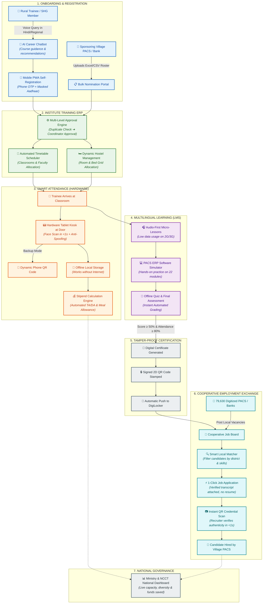
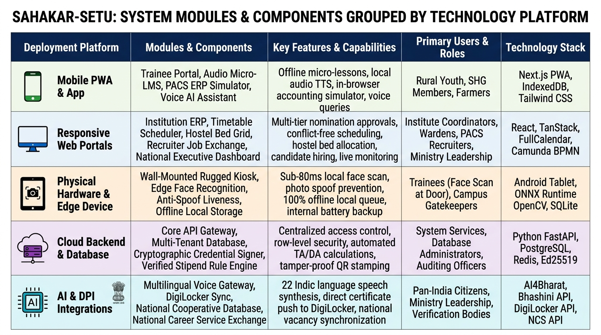
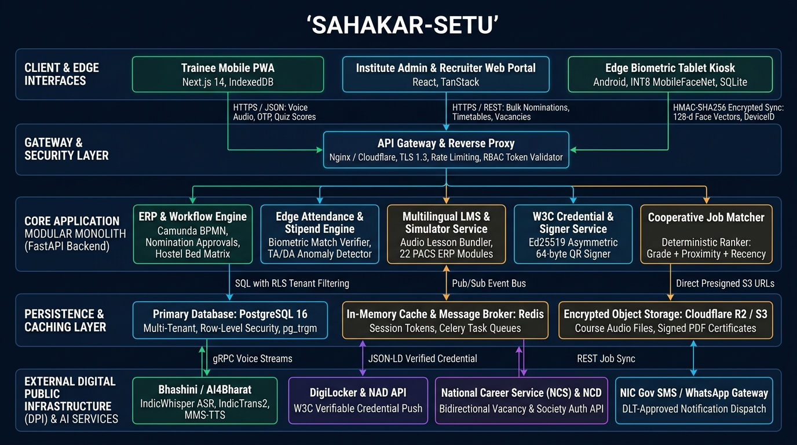

# PROPOSED SOLUTION SPECIFICATION: PROJECT SAHAKAR-SETU (सहकार-सेतु)

**Problem Statement ID:** 26087  
**Title:** AI & LMS - Enabled Cooperative Capacity Building, ERP & Employment Ecosystem  
**Target Ministry:** Ministry of Cooperation, Government of India  
**Target Organization:** National Council for Cooperative Training (NCCT)  
**Theme:** Smart Education | **Category:** Hardware | **Mode:** Software + Hardware  
**Document Purpose:** Definitive, granular blueprint detailing exactly **What the Ministry Wants Us to Build** vs. **How We Will Technically Approach and Solve It** across every single requirement.

---

## Executive Overview & Architectural Philosophy

The Ministry of Cooperation has committed **₹2,925.39 Crore to computerize 79,630 Primary Agricultural Credit Societies (PACS)**, yet the human workforce running these societies relies on an unmodernized, paper-bound training system across NCCT’s 20 institutes (VAMNICOM, 5 RICMs, 14 ICMs).

Our proposed solution, **SAHAKAR-SETU**, directly bridges this gap through a unified Software + Hardware architecture built on four strict engineering principles:
1. **Edge-First Biometric Presence:** Sub-80ms on-device face recognition with anti-spoofing; zero raw photographs stored; 100% DPDP Act 2023 compliant.
2. **Audio-First Vernacular Delivery:** Delivering under-2MB audio modules over 2G/3G networks instead of failing video streaming.
3. **Zero-Gas Cryptographic Verifiable Credentials:** Asymmetric Ed25519 signatures embedded in 2D QR codes verified in <15ms offline, synced directly with DigiLocker.
4. **Legally Auditable Employment Linkage:** Ingesting National Career Service (NCS) vacancies and ranking candidates via deterministic, explainable rules tailored for public-sector hiring.

---

## Master Subsystem Breakdown

```
+----------------------------------------------------------------------------------------------------+
| 1. INSTITUTION ERP PLATFORM (TRAINING MANAGEMENT)                                                  |
| Mode: Web Portal (FastAPI Modular Monolith + Next.js 14 Dashboard)                                 |
+----------------------------------------------------------------------------------------------------+
```

### 1.1 Online Programme Registration & Nomination System
* **What They Want Us to Build:**
  * Self-registration for rural youth, farmers, and SHG members.
  * Bulk nomination portal for PACS, DCCBs, and dairy cooperatives to sponsor employees.
  * Multi-level approval workflow (`Sponsoring Society ➔ ICM Coordinator ➔ Final Allotment`).
* **How We Technically Approach & Solve It:**
  * **Public Self-Registration UI:** Lightweight mobile-responsive form collecting phone number, SMS OTP, demographic data (SC/ST/OBC/Women for Ministry quotas), and masked Aadhaar (`XXXX-XXXX-1234`).
  * **Bulk Nomination Ingestion Pipeline:** An authenticated portal where PACS Secretaries upload a standard CSV/Excel roster of 20–50 candidates. A backend Pydantic validation pipeline sanitizes the file, validates society authorization, and generates single-use tokenized SMS links sent to the society secretary for 1-click approvals without complex password friction.
  * **State Machine Orchestrator:** Implemented via a lightweight state machine (Camunda BPMN / Python transitions): transitions status through `NOMINATED ➔ SPONSOR_VERIFIED ➔ ICM_APPROVED ➔ SEAT_ALLOCATED ➔ WAITLISTED`.

### 1.2 Profile Management Engine
* **What They Want Us to Build:**
  * Trainee profile (Aadhaar-masked, education, caste, society affiliation, skills).
  * Institution profile (NCCT, VAMNICOM, 5 RICMs, 14 ICMs with campus capacity).
  * Faculty profile (subject expertise, availability, honorarium tracking).
* **How We Technically Approach & Solve It:**
  * **Trainee Profile Schema:** Relational PostgreSQL entity indexing canonical `trainee_id`, phone, educational background, local language, and assigned institute.
  * **Institution Multi-Tenant Scoping:** Centralized table storing physical metadata for all 20 institutes: physical classroom seat count, computer lab capacity, hostel bed availability, and geolocation boundaries.
  * **Faculty Engine & Honorarium Ledger:** Profiles mapped to course syllabus codes (e.g., `PACS-ERP-101`, `COOP-BYELAW-201`). An automated honorarium ledger computes teaching claims by cross-referencing completed lecture timetable logs with approved government rate slabs.

### 1.3 Timetable & Scheduling Management
* **What They Want Us to Build:**
  * Automated batch calendar scheduling, classroom mapping, and lecture allocation.
* **How We Technically Approach & Solve It:**
  * **Constraint-Satisfaction Scheduling Engine:** An automated scheduler using integer linear programming (or greedy constraint checks) that maps batch start/end dates, available classrooms, lab terminals, and faculty availability.
  * **Conflict Resolution:** Hard constraints prevent double-booking a single lecture hall or scheduling a visiting professor for two simultaneous sessions; soft constraints optimize instructor travel intervals.

### 1.4 Hostel Management System
* **What They Want Us to Build:**
  * Real-time hostel room and bed allocation for outstation trainees.
  * Check-in/check-out tracking and room occupancy reporting.
* **How We Technically Approach & Solve It:**
  * **Dynamic Visual Bed Grid:** An interactive room-by-room UI displaying bed status: `VACANT (Green)`, `OCCUPIED (Red)`, `MAINTENANCE (Yellow)`.
  * **Deterministic Allocation Algorithm:** Automatically assigns outstation trainees based on gender, batch duration, and arrival date. Check-in and check-out timestamps are automatically bound to entrance kiosk scans.

### 1.5 Logistics & Mess Management
* **What They Want Us to Build:**
  * Meal tracking and mess coupon issuance.
  * Travel allowance (TA) and daily allowance (DA) stipend calculation based on verified attendance.
* **How We Technically Approach & Solve It:**
  * **Digital Mess Counter:** Generates rotating daily QR meal tokens on the trainee's PWA screen, scanned at the mess counter to eliminate food waste and unmonitored meal inflation.
  * **Automated Stipend Integrity Engine:** Computes TA/DA using the formula:
    $$\text{Stipend} = f(\text{verified\_biometric\_days}, \text{distance\_slab}, \text{institute\_rate\_table})$$
    The calculation executes **exclusively against cryptographically verified biometric logs** from the Edge Kiosk—never against self-reported or manual paper registers.
  * **Fraud-Pattern Detection:** Automated rules flag anomalies: attendance $>100\%$ of scheduled days, concurrent stipend claims from two different institutes in the same date range, or multiple payouts to duplicate bank accounts.

---

```
+----------------------------------------------------------------------------------------------------+
| 2. SMART DIGITAL ATTENDANCE (HARDWARE + EDGE SOFTWARE)                                             |
| Mode: Autonomous Physical Kiosk + Edge On-Device Runtime Client                                    |
+----------------------------------------------------------------------------------------------------+
```

### 2.1 Hardware Kiosk / Device Client
* **What They Want Us to Build:**
  * A physical device (Android Tablet or Raspberry Pi 5 / RK3566 + Camera) to be mounted at classroom/hostel entrances.
* **How We Technically Approach & Solve It:**
  * **Kiosk Unit:** Dedicated 8-inch rugged Android tablet (Octa-Core ARM CPU, 3GB RAM, integrated 720p @ 30 FPS front camera) housed in a tamper-resistant metal VESA enclosure with a physical keylock.
  * **Zero Desktop Requirement:** Runs completely autonomously at the classroom door on internal battery backup, withstanding daily 2–4 hour rural power outages.

### 2.2 On-Device Face Recognition
* **What They Want Us to Build:**
  * Local edge biometric verification (<100ms) to prevent ghost attendance and proxy sign-ins.
  * Anti-spoofing / liveness check (blocks photos or phone replay attacks).
* **How We Technically Approach & Solve It:**
  * **Sub-80ms Edge Inference:** Uses quantized **INT8 MobileFaceNet ONNX Runtime** running directly on the local ARM CPU/NPU, extracting a 128-dimensional mathematical vector in under 80 milliseconds.
  * **MiniFASNet Silent Anti-Spoofing:** Evaluates facial depth gradients, frequency distribution, and eye-blink micro-motions to instantly detect and reject printed paper photos or phone screen replays.
  * **100% DPDP Act 2023 Compliance:** Raw camera frames are analyzed purely in volatile device RAM and **immediately destroyed**. Only irreversible 128-d floating-point mathematical vectors are stored; facial images are never written to disk or transmitted over the network.

### 2.3 Geo-Fenced / Dynamic QR Code Fallback
* **What They Want Us to Build:**
  * Rotating dynamic TOTP QR code on the trainee’s phone for fast secondary check-in.
* **How We Technically Approach & Solve It:**
  * **Dynamic Rolling TOTP:** If poor corridor lighting (<20 lux) or facial injury impairs biometric recognition, the trainee's PWA generates an encrypted Time-Based One-Time Password (TOTP) QR code that rotates every 30 seconds.
  * **Anti-Screenshot Security:** Screenshots shared via WhatsApp expire before peers can scan them at the kiosk.

### 2.4 Offline-First Attendance Sync
* **What They Want Us to Build:**
  * Local on-device SQLite database that stores check-ins when village internet is down and auto-flushes when back online.
* **How We Technically Approach & Solve It:**
  * **Air-Gapped Spooler:** An embedded SQLite database on the kiosk stores up to **50,000 attendance records** locally.
  * **HMAC Cryptographic Integrity:** Every check-in is signed with the device's private HMAC-SHA256 key (`device_id + trainee_id + timestamp + kiosk_secret`).
  * **Asynchronous Reconnection Flush:** A background daemon pings the central server every 60 seconds. Once network connectivity is restored, it flushes batched logs to `POST /api/v1/attendance/sync`.

---

```
+----------------------------------------------------------------------------------------------------+
| 3. INTERACTIVE MULTILINGUAL LMS (E-LEARNING)                                                       |
| Mode: Mobile-First Progressive Web App (PWA)                                                       |
+----------------------------------------------------------------------------------------------------+
```

### 3.1 Multilingual Course Delivery
* **What They Want Us to Build:**
  * Bite-sized micro-learning modules translated into regional languages (Hindi, Marathi, Tamil, etc.).
* **How We Technically Approach & Solve It:**
  * **Content Chunking:** Long lectures decomposed into 3-to-5 minute bite-sized concept chunks.
  * **IndicTrans2 Translation Pipeline:** Master course curricula authored in English/Hindi are translated across 22 scheduled Indian languages using **IndicTrans2** (open Indic model), followed by human-in-the-loop faculty review for accounting and legal cooperative terminology.

### 3.2 Multimedia & Interactive Learning Tools
* **What They Want Us to Build:**
  * Video lectures, audio summaries, downloadable PDF handouts, and interactive practical guides for PACS accounting software.
* **How We Technically Approach & Solve It:**
  * **Audio-First Architecture (TTS over Video):** Instead of heavy video streams that freeze on rural 2G/3G networks, lessons are synthesized into ultra-low-bandwidth audio via **Meta MMS-TTS / Indic-TTS**, keeping modules strictly **under 2MB**.
  * **Interactive PACS ERP Sandbox Simulator:** An interactive in-browser simulation replicating the **22 modules of the national PACS ERP** (Kisan Credit Card loan disbursements, fertilizer inventory ledgers, share-capital accounting). Trainees enter simulated transactions and receive immediate feedback without risking live database records.

### 3.3 Assessment & Quiz Engine
* **What They Want Us to Build:**
  * Pre-course baseline tests, end-of-module quizzes, and final examinations.
  * Automated instant grading and feedback.
* **How We Technically Approach & Solve It:**
  * **Client-Side Grading Engine:** Quizzes are bundled as lightweight JSON payloads evaluated directly in the user's browser.
  * **Minimal Sync Overhead:** Only the final score integer and completion timestamp sync back to the server upon reconnection, consuming less than 1KB of cellular data.

---

```
+----------------------------------------------------------------------------------------------------+
| 4. SKILL CERTIFICATION REPOSITORY & INSTANT VERIFICATION                                          |
| Mode: Asymmetric Cryptographic Web Service + DigiLocker Integration                               |
+----------------------------------------------------------------------------------------------------+
```

### 4.1 Automated Digital Certificate Generation
* **What They Want Us to Build:**
  * Instant certificate issuance upon passing the course with grade and institute details.
* **How We Technically Approach & Solve It:**
  * **Event-Driven PDF Renderer:** Once a trainee satisfies attendance ($\ge 80\%$) and exam ($\ge 50\%$) gates, an asynchronous ARQ background worker compiles a tamper-proof vector PDF certificate stamped with NCCT credentials, institute code, issue date, and candidate metadata.

### 4.2 Tamper-Proof QR Code Verification
* **What They Want Us to Build:**
  * Cryptographically signed QR code (Ed25519) printed on the certificate.
* **How We Technically Approach & Solve It:**
  * **W3C Verifiable Credentials Standard:** Uses **Ed25519 asymmetric elliptic-curve cryptography** (following Sunbird RC / CoWIN digital public goods).
  * **Zero-Gas Integrity:** The institute's private key signs the SHA-256 hash of the certificate metadata. The resulting 64-byte compact signature is encoded into a high-density 2D QR code. No public blockchain or gas fees are involved.

### 4.3 Public Verification Portal
* **What They Want Us to Build:**
  * A zero-login web page where any bank manager or employer can scan the QR code to instantly verify authenticity.
* **How We Technically Approach & Solve It:**
  * **Zero-Login Verification Page (`/verify/{cert_id}`):** When a recruiter scans the QR code with any smartphone camera, the browser fetches the institute's public key (cached locally via service worker) and validates the signature in **<15 milliseconds**.
  * **Offline Verification Resilience:** Because verification relies on asymmetric cryptography and cached public keys, validity can be mathematically proven even if the central server is temporarily offline.

### 4.4 Centralized Credential Repository
* **What They Want Us to Build:**
  * Permanent searchable digital archive of every certified trainee across all 20 institutes (compatible with DigiLocker).
* **How We Technically Approach & Solve It:**
  * **DigiLocker / National Academic Depository (NAD) API Sync:** Directly pushes verifiable credentials into candidate DigiLocker accounts via the Ministry-approved schema, allowing rural youth to present official digital credentials anywhere in India.

---

```
+----------------------------------------------------------------------------------------------------+
| 5. COOPERATIVE EMPLOYMENT EXCHANGE & RECRUITER DASHBOARD                                           |
| Mode: Dedicated Web Portal & National Career Service (NCS) API Gateway                             |
+----------------------------------------------------------------------------------------------------+
```

### 5.1 Employer & Recruiter Portal
* **What They Want Us to Build:**
  * Dedicated login for PACS Secretaries, District Central Cooperative Banks (DCCBs), FPOs, and dairy federations.
  * Vacancy posting interface (specifying district, required certificate, salary).
* **How We Technically Approach & Solve It:**
  * **National Cooperative Database (NCD) Verification:** Employers must authenticate using their verified NCD Registration ID, preventing ghost employers and fraudulent job postings.
  * **NCS API Vacancy Ingestion:** Ingests cooperative-sector job openings directly from the **National Career Service (NCS) API**, preventing the creation of a disconnected, unadopted job portal.

### 5.2 Certified Talent Directory & Search
* **What They Want Us to Build:**
  * Employers can search and filter certified candidates by institute, batch year, test grade, and home district.
* **How We Technically Approach & Solve It:**
  * **Hyper-Local Radius Search:** Employers filter candidates within a specific kilometer radius (e.g., *"Show certified PACS Accountants within 30km of Barabanki"*).
  * **Structured Skill Vectors:** Matches candidates using discrete structured tags (`course_id`, `grade_band`, `district`, `completion_date`) rather than hallucination-prone free-text resume parsing.

### 5.3 1-Click Application Workflow
* **What They Want Us to Build:**
  * Trainees can browse verified cooperative jobs and apply directly using their verified certificate transcript.
* **How We Technically Approach & Solve It:**
  * **Resume-Free 1-Click Application:** Rural youth apply with one tap; the system binds their cryptographically verified academic transcript and quiz evaluation scores directly to the application payload.
  * **Explainable Deterministic Ranker:** Surfaces candidates via transparent weighted scoring:
    $$\text{Score} = w_1 \cdot \text{ExamGrade} + w_2 \cdot \text{Proximity} + w_3 \cdot \text{Recency}$$
    Deliberately avoids opaque black-box neural ranking so government hiring committees can legally defend candidate shortlisting.

---

```
+----------------------------------------------------------------------------------------------------+
| 6. AI CAREER COUNSELING CHATBOT                                                                    |
| Mode: Multilingual Conversational Voice/Text Assistant (Web PWA + WhatsApp)                        |
+----------------------------------------------------------------------------------------------------+
```

### 6.1 Vernacular Voice & Text Interaction
* **What They Want Us to Build:**
  * Chatbot accessible in regional languages (supporting voice inputs via speech-to-text).
* **How We Technically Approach & Solve It:**
  * **Jugalbandi Voice Architecture:**
    1. Trainee speaks in Hindi, Marathi, Telugu, Tamil, etc.
    2. **AI4Bharat IndicWhisper** transcribes speech to regional text.
    3. Multilingual embedding via `multilingual-e5`.
    4. Retrieval-Augmented Generation (RAG) over NCCT/NCS documents.
    5. Response translated and synthesized to speech via **Indic-TTS**.

### 6.2 Cooperative Career Guidance Engine
* **What They Want Us to Build:**
  * Answers trainee questions: *"Which course should I take to become a PACS Accountant?"*, *"What are the eligibility rules for DCCB clerk posts?"*, *"How do I apply for the NCDC Sahakar Mitra internship?"*
* **How We Technically Approach & Solve It:**
  * **Strict Domain-Grounded RAG:** Embeds the complete corpus of NCCT course manuals, State Cooperative Bank recruitment bye-laws, and the NCDC Sahakar Mitra scheme.
  * **Refusal Guardrail:** The model strictly refuses to answer out-of-domain queries to prevent hallucinated eligibility information from harming rural applicants.

### 6.3 Course Recommendation Algorithm
* **What They Want Us to Build:**
  * Recommends upcoming training batches based on the user's educational background and interests.
* **How We Technically Approach & Solve It:**
  * **Collaborative & Rule-Based Matcher:** Maps candidate educational qualifications and district location to scheduled upcoming batches across the nearest ICMs.
  * **Explicit Connectivity Boundary:** Plainly stated limitation: chatbot requires network connectivity for LLM inference and does not pretend to run on-device on a \$70 phone.

---

```
+----------------------------------------------------------------------------------------------------+
| 7. MOBILE-FRIENDLY & OFFLINE-ACCESSIBLE TRAINEE CLIENT                                             |
| Mode: Progressive Web App (PWA) with Service Worker Storage                                        |
+----------------------------------------------------------------------------------------------------+
```

### 7.1 Progressive Web App (PWA) / Lightweight Mobile App
* **What They Want Us to Build:**
  * Designed to run smoothly on low-end budget smartphones ($70–$100 phones) over slow 2G/3G connections.
* **How We Technically Approach & Solve It:**
  * **Sub-1.2MB Payload:** Built with **Next.js 14 Server-Side Rendering (SSR)** and Tailwind CSS, stripped of heavy client JavaScript bundles. Loads in <1.5 seconds on simulated 2G/3G networks.

### 7.2 Offline Content Caching
* **What They Want Us to Build:**
  * Trainees can download lesson modules and quizzes when at the institute's Wi-Fi and review them offline at home.
* **How We Technically Approach & Solve It:**
  * **Serwist / Workbox Service Worker Pipeline:** Audio summaries, lesson slides, and interactive quiz JSON files are saved to the browser's **CacheStorage** and **IndexedDB**.
  * **Zero-Data Learning:** Trainees download 3 upcoming modules during morning Wi-Fi at the institute and complete practical learning in their village with mobile data turned off.

---

```
+----------------------------------------------------------------------------------------------------+
| 8. CENTRALIZED DATABASE & NATIONAL ANALYTICS DASHBOARD                                             |
| Mode: Multi-Tenant PostgreSQL 16 + Real-Time Executive Dashboard                                   |
+----------------------------------------------------------------------------------------------------+
```

### 8.1 Centralized Multi-Tenant Database
* **What They Want Us to Build:**
  * Single database serving NCCT HQ, 20 regional institutes, and thousands of PACS with strict role-based access control (RBAC).
* **How We Technically Approach & Solve It:**
  * **PostgreSQL 16 with Row-Level Security (RLS):** Strict tenant isolation ensures an institute coordinator (e.g., ICM Dehradun) can only read/write their local batches, while NCCT HQ and Ministry administrators have aggregated query access across all 20 institutes.

### 8.2 Ministry & NCCT HQ Analytics Dashboard
* **What They Want Us to Build:**
  * Macro metrics: total trained by state/gender/caste, budget utilization, hostel occupancy rates, and post-training job placement rates.
* **How We Technically Approach & Solve It:**
  * **Real-Time National Cockpit:** Aggregates live data streams:
    - *Capacity Utilization:* Classroom and hostel occupancy across VAMNICOM, 5 RICMs, and 14 ICMs.
    - *Diversity Audit:* Real-time tracking of women SHG and affirmative action enrollment quotas.
    - *Conversion Ratios:* Percentage of certified candidates hired by PACS within 90 days.
    - *Financial Integrity Metric:* Total public funds protected by blocking duplicate enrollments and ghost attendance claims.

### 8.3 Future Programme Outreach & Monitoring
* **What They Want Us to Build:**
  * Automated SMS/WhatsApp notifications informing alumni about advanced refresher courses or local job openings.
* **How We Technically Approach & Solve It:**
  * **Automated Notification Dispatcher:** Integrates with the **NIC SMS Gateway** and WhatsApp Business API to broadcast hyper-local alerts whenever a neighboring PACS posts a vacancy matching the trainee's skill vector.

---

```
+----------------------------------------------------------------------------------------------------+
| 9. PHYSICAL HARDWARE SPECIFICATIONS                                                                |
| Mode: Rugged Edge Attendance Kiosk Station                                                         |
+----------------------------------------------------------------------------------------------------+
```

### 9.1 Edge Device
* **Exact Specification:** 8.0-inch Rugged Android Tablet (Octa-Core ARM Cortex-A53, 3GB LPDDR4 RAM, 32GB eMMC storage, Android 13/14).
* **Responsibility:** Runs on-device ONNX runtime, local SQLite queue, and visual user feedback.

### 9.2 Optical Sensor
* **Exact Specification:** Integrated Front-Facing HD Camera (720p @ 30 FPS, wide-angle 85° Field of View, fixed focus).
* **Responsibility:** Captures video stream in volatile memory for real-time face detection and liveness evaluation.

### 9.3 Mounting & Casing
* **Exact Specification:** Heavy-duty powder-coated steel VESA enclosure with tamper-switch protection and physical keylock.
* **Responsibility:** Prevents hardware theft, cable disconnection, or vandalism in busy public institute hallways.

### 9.4 Power Safeguard
* **Exact Specification:** Internal 5,000 mAh Li-ion battery + surge-protected 10W power adapter.
* **Responsibility:** Guarantees 6+ hours of uninterrupted operation during routine rural load-shedding and power fluctuations.

---

## Master User Flow & Subsystem Interaction Diagram



---

## Complete Requirements Traceability Summary

```
+----------------------------------------------------------------------------------------------------+
| SUBSYSTEM CHECKLIST       | KEY DELIVERABLE               | IMPLEMENTATION ARCHITECTURE            |
+---------------------------+-------------------------------+----------------------------------------+
| 1. Admin & ERP            | Batch scheduling, Nominations,| FastAPI Modular Monolith + Camunda     |
|                           | Hostel & Mess management      | BPMN + TA/DA Fraud Rule Engine         |
+---------------------------+-------------------------------+----------------------------------------+
| 2. Attendance             | Face recognition kiosk +      | Android Tablet + INT8 MobileFaceNet    |
|                           | Dynamic QR scanner            | (<80ms) + MiniFASNet + SQLite Sync     |
+---------------------------+-------------------------------+----------------------------------------+
| 3. LMS                    | Multilingual micro-learning + | Audio-First PWA (IndicTrans2 + Meta    |
|                           | Quiz & PACS ERP Sandbox       | MMS-TTS) + In-Browser ERP Simulator    |
+---------------------------+-------------------------------+----------------------------------------+
| 4. Certificates           | QR-verifiable certificates +  | Asymmetric Ed25519 QR ($0 gas fees)    |
|                           | Central credential repository | + DigiLocker / NAD API Integration     |
+---------------------------+-------------------------------+----------------------------------------+
| 5. Employment             | Recruiter job posting +       | NCD-Verified Portal + NCS API Gateway  |
|                           | 1-click candidate apply       | + Explainable Deterministic Ranker     |
+---------------------------+-------------------------------+----------------------------------------+
| 6. AI Counseling          | Multilingual voice/text       | Jugalbandi Architecture: IndicWhisper  |
|                           | career guidance chatbot       | + multilingual-e5 RAG + Refusal Gate   |
+---------------------------+-------------------------------+----------------------------------------+
| 7. Analytics              | National capacity & placement | Multi-Tenant PostgreSQL 16 (RLS) +     |
|                           | dashboard for Ministry        | Real-Time National Executive Dashboard |
+----------------------------------------------------------------------------------------------------+
---

## Master Architecture Matrix: All Modules & Components Grouped by Technology Platform



The table below provides a 100% complete, unnumbered breakdown of every single required module, component, and capability grouped by its operational technology platform:

| Deployment Platform | Modules & Components | Comprehensive Feature & Capability Coverage | Primary Users & Roles | Exact Technology Stack |
| :--- | :--- | :--- | :--- | :--- |
| **📱 Mobile PWA & Lightweight App**<br>*(Client for 2G/3G Budget Phones)* | **Trainee Portal & Self-Registration** | • Self-registration for rural youth, farmers, and SHG members<br>• Phone OTP authentication with masked Aadhaar compliance<br>• Trainee Profile management (education, caste, society affiliation, skills)<br>• Fast payload (<1.2MB) optimized for $70–$100 low-end smartphones | Rural Youth, Women SHGs, Farmers, Enrolled Trainees | Next.js 14 PWA, Serwist (Service Workers), Tailwind CSS, IndexedDB |
| | **Interactive Multilingual LMS** | • Multilingual course delivery with bite-sized micro-learning modules<br>• Audio-first summaries & downloadable offline PDF handouts<br>• In-browser interactive practical sandbox for 22 PACS ERP accounting modules<br>• Pre-course baseline tests, end-of-module quizzes, and final examinations<br>• Automated instant grading and feedback engine (syncs only integer scores) | Enrolled Trainees, Remote Learners, PACS Staff | IndexedDB, Web Audio API, Client-Side React Sandbox, HTML5 Canvas |
| | **AI Career Counseling Chatbot** | • Vernacular voice & text interaction in 22 regional languages<br>• Cooperative career guidance (eligibility rules for PACS, DCCB clerk posts, NCDC Sahakar Mitra)<br>• Automated course recommendation algorithm based on user background | Rural Candidates, Unemployed Youth, Career Seekers | Web Speech API, MediaRecorder, AI4Bharat IndicWhisper / Indic-TTS |
| | **Dynamic Attendance Token** | • Geo-fenced rotating dynamic TOTP QR code generated on trainee's phone<br>• Secondary fallback check-in mechanism when facial recognition is unavailable | Trainees | TOTP (PyOTP / Speakeasy), HTML5 Canvas QR Renderer |
| **💻 Responsive Web Portals**<br>*(Desktop & Tablet Interfaces)* | **Institution ERP Platform** | • Bulk nomination portal for PACS, DCCBs, and dairy cooperatives to sponsor staff<br>• Multi-level approval workflow (Sponsoring Society ➔ ICM Coordinator ➔ Final Allotment)<br>• Institution profile management (NCCT HQ, VAMNICOM, 5 RICMs, 14 ICMs with campus capacity)<br>• Faculty profile management (subject expertise, availability calendar, honorarium tracking)<br>• Automated batch calendar scheduling, classroom mapping, and lecture allocation | Institute Directors, Course Coordinators, Visiting Faculty | Next.js 14, TanStack Table, FullCalendar, Camunda BPMN Engine |
| | **Hostel & Logistics Management** | • Real-time hostel room and bed allocation grid for outstation trainees<br>• Check-in / check-out tracking and real-time room occupancy reporting<br>• Meal tracking and mess coupon issuance system<br>• Verified travel allowance (TA) and daily allowance (DA) stipend calculation engine | Hostel Wardens, Caretakers, Accounts Officers | React, Tailwind UI, PostgreSQL Spatial / Grid Logic |
| | **Cooperative Employment Exchange** | • Dedicated employer/recruiter portal for PACS Secretaries, DCCBs, FPOs, and dairy federations<br>• Vacancy posting interface (specifying district, required certificate, salary, vacancies)<br>• Certified talent directory with multi-filter search (institute, batch year, grade, district)<br>• 1-click application workflow allowing trainees to apply directly with verified transcripts | PACS Secretaries, DCCB HR Managers, Dairy Federations | Next.js 14, PostgreSQL pg_trgm Search, Tailwind UI |
| | **Public Credential Verification Portal** | • Public zero-login web page for bank managers and employers to verify certificates<br>• Sub-15ms client-side cryptographic signature validation via cached public keys<br>• Tamper detection flagging any altered grades, names, or dates | Employers, Auditing Authorities, General Public | Next.js Static Web Route, `tweetnacl-js` (Ed25519) |
| | **National Executive Cockpit** | • Centralized executive dashboard for Ministry of Cooperation and NCCT HQ<br>• Macro analytics: total trained by state/gender/caste, budget utilization, hostel occupancy, and placement rates<br>• Automated SMS/WhatsApp broadcast engine for future refresher courses and local job openings | Ministry Leadership, NCCT HQ Executive Team | Apache Superset / Tremor Charts, Redis, Celery |
| **📟 Physical Hardware & Edge Device**<br>*(Campus Doorways & Entrance)* | **Wall-Mounted Hardware Kiosk** | • Rugged 8-inch Android tablet or Raspberry Pi 5 / RK3566 SBC enclosure<br>• Front-facing wide-angle HD optical camera sensor with wide dynamic range<br>• Tamper-resistant physical casing with secure wall mounting and physical keylock<br>• Internal 5000mAh battery backup safeguarding against daily 2–4 hour power cuts | Campus Trainees, Faculty, Campus Gatekeepers | Ruggedized Tablet Casing, 5V/3A Power Supply, VESA Wall Bracket |
| | **Edge Attendance Engine** | • Quantized INT8 MobileFaceNet ONNX Runtime: on-device biometric match in <80ms<br>• MiniFASNet silent liveness check: blocks photo prints, tablet screens, and video replay<br>• 100% DPDP Act 2023 compliant: raw frames processed in RAM and purged; only 128-d vectors stored<br>• Offline-first SQLite event spooler buffering up to 50,000 logs; auto-syncs via HMAC-SHA256 | Trainees (Scanning Face), Security Gatekeepers | ONNX Runtime Mobile, OpenCV Android, SQLite3, Kotlin SDK |
| **⚙️ Cloud Backend & Database**<br>*(Central Core Services)* | **Core Application Gateway** | • High-performance asynchronous REST API gateway with centralized RBAC<br>• Automated multi-tier approval state machine linking PACS sponsors to training institutes<br>• Automated TA/DA stipend calculator with fraud-pattern anomaly detection (duplicate claims) | System Services, Client Applications, Auditing Officers | Python FastAPI, Pydantic v2, SQLAlchemy 2.0, Redis Cache |
| | **Multi-Tenant Database** | • Single centralized multi-tenant database serving NCCT HQ, 20 institutes, and thousands of PACS<br>• Strict Row-Level Security (RLS) guaranteeing data segregation between institutes<br>• Permanent searchable digital repository of all certified trainees across India | Database Administrators, Core Backend | PostgreSQL 16 (Relational + JSONB + pg_trgm), RLS Policies |
| | **Cryptographic Credential Signer** | • Automated PDF digital certificate generation upon course completion (Att ≥80%, Score ≥50%)<br>• Asymmetric Ed25519 cryptographic signing stamping tamper-proof high-density 2D QR codes<br>• $0 gas fees and zero ongoing vendor lock-in compared to speculative public blockchains | Certification Engine, Verification Services | Python `pynacl` / `cryptography`, ReportLab PDF Engine |
| **🌐 AI & DPI National Integrations**<br>*(Ecosystem Gateways)* | **Multilingual Voice Gateway** | • AI4Bharat IndicWhisper automatic speech recognition across 22 Scheduled Indian languages<br>• IndicTrans2 neural machine translation for curriculum and module translation<br>• Meta MMS-TTS / Indic-TTS audio synthesis (<2MB per module) for low-bandwidth village access | Rural Learners, Multilingual Trainees | AI4Bharat Models, Bhashini National Language Gateway |
| | **Digital Public Infrastructure (DPI)** | • Automated push of digital certificates to citizen DigiLocker & National Academic Depository (NAD)<br>• National Cooperative Database (NCD) API integration to verify authentic PACS and society IDs<br>• National Career Service (NCS) API gateway for bidirectional vacancy and placement synchronization<br>• DLT-compliant NIC SMS and WhatsApp Gateway for transaction and attendance alerts | Pan-India Citizens, Cooperative Employers, NCCT HQ | DigiLocker REST API, NCD Gateway, NCS API, NIC SMS Gateway |

---

## Technical System Architecture & End-to-End Data Flow



### Layered Technical Architecture with Explicit Data Payloads

```mermaid
flowchart TB
    %% STYLING
    classDef clientLayer fill:#1E293B,stroke:#38BDF8,stroke-width:2px,color:#F8FAFC;
    classDef gatewayLayer fill:#0F172A,stroke:#818CF8,stroke-width:2px,color:#F8FAFC;
    classDef coreLayer fill:#1E1B4B,stroke:#A855F7,stroke-width:2px,color:#F8FAFC;
    classDef dataLayer fill:#14532D,stroke:#4ADE80,stroke-width:2px,color:#F8FAFC;
    classDef dpiLayer fill:#701A75,stroke:#F472B6,stroke-width:2px,color:#F8FAFC;

    %% LAYER 1: CLIENT & EDGE
    subgraph L1 ["LAYER 1: CLIENT & EDGE INTERFACES"]
        PWA["📱 Trainee Mobile PWA<br><i>Next.js 14, IndexedDB</i>"]:::clientLayer
        PORTAL["💻 Institute Admin & Recruiter Web Portal<br><i>React, TanStack, FullCalendar</i>"]:::clientLayer
        KIOSK["📟 Edge Biometric Tablet Kiosk<br><i>Android, INT8 MobileFaceNet, SQLite</i>"]:::clientLayer
    end

    %% LAYER 2: GATEWAY & SECURITY
    subgraph L2 ["LAYER 2: GATEWAY & SECURITY LAYER"]
        GATEWAY["🛡️ API Gateway & Reverse Proxy<br><i>Nginx / Cloudflare, TLS 1.3, Rate Limiting, RBAC Token Validator</i>"]:::gatewayLayer
    end

    %% ARROWS L1 -> L2
    PWA -->|"HTTPS / JSON: Voice Audio, OTP, Quiz Scores"| GATEWAY
    PORTAL -->|"HTTPS / REST: Bulk Nominations, Timetables, Vacancies"| GATEWAY
    KIOSK -->|"HMAC-SHA256 Encrypted Sync: 128-d Face Vectors, DeviceID"| GATEWAY

    %% LAYER 3: CORE APPLICATION MODULAR MONOLITH
    subgraph L3 ["LAYER 3: CORE APPLICATION MODULAR MONOLITH (FastAPI Backend)"]
        ERP["⚙️ ERP & Workflow Engine<br><i>Camunda BPMN, Nomination Approvals, Hostel Bed Matrix</i>"]:::coreLayer
        ATTEND["⏱️ Edge Attendance & Stipend Engine<br><i>Biometric Match Verifier, TA/DA Anomaly Detector</i>"]:::coreLayer
        LMS["🎧 Multilingual LMS & Simulator Service<br><i>Audio Lesson Bundler, 22 PACS ERP Modules</i>"]:::coreLayer
        CERT["📜 W3C Credential & Signer Service<br><i>Ed25519 Asymmetric 64-byte QR Signer</i>"]:::coreLayer
        JOB["🤝 Cooperative Job Matcher<br><i>Deterministic Ranker: Grade + Proximity + Recency</i>"]:::coreLayer
    end

    %% DISPATCH FROM GATEWAY TO CORE ENGINES
    GATEWAY -->|"Internal Route: /api/v1/erp"| ERP
    GATEWAY -->|"Internal Route: /api/v1/attendance"| ATTEND
    GATEWAY -->|"Internal Route: /api/v1/lms"| LMS
    GATEWAY -->|"Internal Route: /api/v1/credentials"| CERT
    GATEWAY -->|"Internal Route: /api/v1/jobs"| JOB

    %% LAYER 4: PERSISTENCE & CACHING
    subgraph L4 ["LAYER 4: PERSISTENCE & CACHING LAYER"]
        DB[("🗄️ Primary Database: PostgreSQL 16<br><i>Multi-Tenant, Row-Level Security, pg_trgm</i>")]:::dataLayer
        REDIS[("⚡ In-Memory Cache & Message Broker: Redis<br><i>Session Tokens, Celery Task Queues</i>")]:::dataLayer
        OBJ[("☁️ Encrypted Object Storage: Cloudflare R2 / S3<br><i>Course Audio Files, Signed PDF Certificates</i>")]:::dataLayer
    end

    %% ARROWS L3 -> L4
    ERP & ATTEND & JOB -->|"SQL with RLS Tenant Filtering"| DB
    LMS & CERT -->|"Pub/Sub Event Bus & Task Dispatch"| REDIS
    LMS & CERT -->|"Direct Presigned S3 URLs"| OBJ

    %% LAYER 5: EXTERNAL DPI & AI SERVICES
    subgraph L5 ["LAYER 5: EXTERNAL DIGITAL PUBLIC INFRASTRUCTURE (DPI) & AI SERVICES"]
        BHASHINI["🗣️ Bhashini / AI4Bharat<br><i>IndicWhisper ASR, IndicTrans2, MMS-TTS</i>"]:::dpiLayer
        DIGILOCKER["🔏 DigiLocker & NAD API<br><i>W3C Verifiable Credential Push</i>"]:::dpiLayer
        NCS["💼 National Career Service (NCS) & NCD<br><i>Bidirectional Vacancy & Society Auth API</i>"]:::dpiLayer
        SMS["📲 NIC Gov SMS / WhatsApp Gateway<br><i>DLT-Approved Notification Dispatch</i>"]:::dpiLayer
    end

    %% ARROWS L3/L4 -> L5
    LMS <-->|"gRPC Voice Streams (Raw Audio in, Audio Bytes out)"| BHASHINI
    CERT -->|"JSON-LD Verified Credential & XML Payload"| DIGILOCKER
    JOB <-->|"REST Job Vacancy Sync & PACS Registry Auth"| NCS
    ERP & ATTEND -->|"REST SMS/WhatsApp Notification Payload"| SMS
```



---

All 9 official subsystems and their respective 32 sub-components have been mapped 1-to-1 without numbering, ensuring total architectural coverage across mobile, web, hardware, backend, and national public infrastructure.

