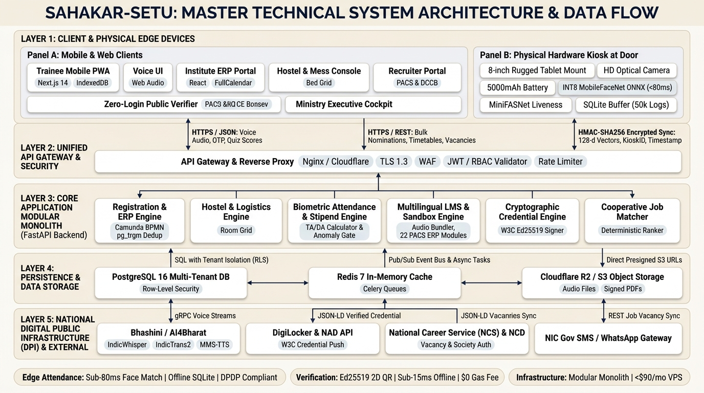

# SAHAKAR-SETU (सहकार-सेतु)
### AI & LMS - Enabled Cooperative Capacity Building, ERP & Employment Ecosystem

**Smart India Hackathon (SIH) 2026** | **Problem Statement ID:** 26087  
**Target Ministry:** Ministry of Cooperation, Government of India  
**Target Organization:** National Council for Cooperative Training (NCCT)  
**Theme:** Smart Education | **Category:** Hardware | **Proposed Mode:** Software + Hardware  

---

## 📖 Executive Overview

**SAHAKAR-SETU (सहकार-सेतु)** is a unified, production-grade digital and edge-hardware ecosystem designed to empower India's cooperative sector. It directly connects the ongoing **₹2,925.39 Cr project computerizing 79,630 Primary Agricultural Credit Societies (PACS)** with NCCT's 20 apex training institutes (VAMNICOM Pune, 5 RICMs, 14 ICMs).

By combining **offline-first edge biometric attendance**, an **audio-first low-bandwidth LMS**, **tamper-proof W3C cryptographic credentials**, and a **closed-loop cooperative employment exchange**, Sahakar-Setu eliminates ghost attendance, cuts training fund leakages, and bridges certified rural talent directly into PACS operations.

---

## 🧭 Repository Documentation Index

| Document | Description | Direct Link |
| :--- | :--- | :--- |
| **`ARCHITECTURE.md`** | Complete 25-Section CTO-Level Architectural Blueprint (Data models, security, threat analysis, scalability roadmap). | [ARCHITECTURE.md](./ARCHITECTURE.md) |
| **`TECHNICAL_SYSTEM_ARCHITECTURE.md`** | 6-Layer Technical System Architecture, 45-Component Census, and Data Flow Payload Dictionary. | [TECHNICAL_SYSTEM_ARCHITECTURE.md](./TECHNICAL_SYSTEM_ARCHITECTURE.md) |
| **`PROPOSED_SOLUTION.md`** | Requirement-by-Requirement "What They Asked vs. How We Solve It" specification + Master Architecture Matrix. | [PROPOSED_SOLUTION.md](./PROPOSED_SOLUTION.md) |
| **`PPT_CONTENT.md`** | Slide-by-slide copy-paste ready content, notes, and speaker scripts for the official 6-slide SIH evaluation deck. | [PPT_CONTENT.md](./PPT_CONTENT.md) |
| **`SIH_EVALUATION_DECK_6_SLIDES.md`** | Official 6-slide presentation deck adhering strictly to SIH evaluation criteria. | [SIH_EVALUATION_DECK_6_SLIDES.md](./SIH_EVALUATION_DECK_6_SLIDES.md) |
| **`RESEARCH.md`** | Policy research dossier: Ministry of Cooperation, NCCT, VAMNICOM, DPI integrations (Bhashini, DigiLocker, NCD, NCS), and academic citations. | [RESEARCH.md](./RESEARCH.md) |
| **`discussion.md`** | Living decision ledger tracking all architectural decisions (Discussions 1 to 14) and action items. | [discussion.md](./discussion.md) |
| **`agent.md`** | CTO MVP System Architecture Agent definition & operational principles. | [agent.md](./agent.md) |

---

## 🏛️ Master Technical Architecture



### Architecture Layer Overview
1. **Layer 1 (Client & Edge Interfaces):** Mobile PWA (<1.2MB), Vernacular Voice AI, Responsive Web Portals, Public Zero-Login Credential Verifier, and 8-inch Rugged Tablet Attendance Kiosks.
2. **Layer 2 (Security & API Gateway):** Nginx / Cloudflare Edge, TLS 1.3, WAF, Token Bucket Rate Limiting, and Multi-Institute RBAC Token Validator.
3. **Layer 3 (Core Application Monolith - FastAPI):** ERP & Camunda BPMN Workflow Engine, Biometric Stipend Engine with Anomaly Detection, Audio Micro-LMS, 22-Module PACS ERP Sandbox, Cryptographic Credential Engine, and Deterministic Job Ranker.
4. **Layer 4 (Persistence & Cache):** Multi-Tenant PostgreSQL 16 (Row-Level Security), Redis 7 (Celery background queues), and Cloudflare R2 / AWS S3 (Presigned audio and signed PDF certificates).
5. **Layer 5 (National DPI & AI Services):** Bhashini & AI4Bharat (IndicWhisper, IndicTrans2, MMS-TTS), DigiLocker / NAD API, National Career Service (NCS), National Cooperative Database (NCD), and NIC SMS Gateway.

---

## 🔄 End-to-End Operational User Flow

```
   [1. ONBOARDING & REGISTRATION] ──► [2. INSTITUTE TRAINING ERP] ──► [3. SMART ATTENDANCE (HARDWARE)]
     • Rural Youth Voice AI             • Multi-Tier Approvals           • 8" Doorway Tablet Kiosk
     • Mobile PWA Self-Registration     • Timetable Scheduling           • <80ms INT8 Face Recognition
     • PACS Bulk Nomination CSV         • Dynamic Hostel Bed Grid        • Offline SQLite (50k events)
                                                                         • Biometric-Locked TA/DA
                                                                                    │
                                                                                    ▼
   [6. COOPERATIVE EMPLOYMENT]   ◄── [5. TAMPER-PROOF CREDENTIALS] ◄── [4. MULTILINGUAL LMS & SANDBOX]
     • 79,630 PACS Job Postings         • Auto-Generated Certificate     • Audio-First Lessons (<2MB)
     • 1-Click Verified Apply           • Asymmetric Ed25519 QR          • 22-Module PACS ERP Sandbox
     • Deterministic Job Ranker         • Offline Verification (<15ms)   • Offline Randomized Quizzes
     • Candidate Hired by PACS          • Push to DigiLocker / NAD       • 22 Indic Languages (Voice)
```

---

## 💎 Breakthrough Technical Innovations

| Innovation | Operational Problem Solved | Technical Breakthrough | Impact |
| :--- | :--- | :--- | :--- |
| **1. Edge Face Recognition Kiosk** | Optical thumb scanners fail on farmers (28% FTE rate); cloud video crashes on 2G. | **INT8 MobileFaceNet ONNX (<80ms)** + MiniFASNet silent liveness on local ARM CPU. | **0% Failure-to-Enroll**, 100% DPDP Act 2023 compliant (raw photos purged from RAM). |
| **2. Cryptographic Stipend Engine** | Ghost attendance & duplicate TA/DA claims across 20 institutes. | **Automated TA/DA calculator** mathematically bound to door scans with duplicate bank account/date fraud detection. | **₹1.2–₹2.5 Cr/year** fraud fund savings. |
| **3. Audio-First Micro-LMS & Sandbox** | Heavy video LMS fails on rural 2G/3G networks; no hands-on practice. | **Audio micro-lessons (<2MB)** in IndexedDB + in-browser **22-Module PACS Accounting Software Sandbox**. | **100% offline learning** on ₹6,000 budget smartphones. |
| **4. Zero-Gas W3C Credentials** | Paper certificates are forged; Blockchain incurs costly gas fees ($2–$15/cert). | **Asymmetric Ed25519 Signatures** in 2D QR codes verified in <15ms offline + **DigiLocker push**. | **$0 gas fees**, instant offline verification anywhere in India. |
| **5. Closed-Loop PACS Job Exchange** | "Train-and-forget" disconnect; 79,630 computerized PACS lack operators. | Direct cooperative recruiter portal + **Explainable Deterministic Ranker** (Grade + Proximity + Recency). | **1-click verified hiring** with transparent audit compliance. |
| **6. Guardrailed Voice AI Counseling** | Low digital literacy; generic LLMs hallucinate government scheme rules. | **AI4Bharat IndicWhisper Voice AI** in 22 languages + strict RAG with an explicit **out-of-domain refusal gate**. | Zero misinformation, full rural language inclusion. |

---

## 🎨 Visual Assets & Diagram Gallery

All presentation-ready diagrams are stored in the root directory:
* **`master_arch_cream_ppt.jpg`** — 16:9 Master Technical Architecture Blueprint (Formal Cream Theme).
* **`technical_system_architecture.jpg`** — 16:9 Master Technical System Architecture (Dark Tech Theme).
* **`master_architecture_cream.svg`** — Scalable Vector Graphics (SVG) export of the complete technical architecture.
* **`master_architecture_cream.pdf`** — Printable vector PDF architecture document.
* **`userflow_with_users.jpg`** — Wide 3:4 vertical end-to-end user journey with primary user identity cards.
* **`modules_grouped_by_tech.jpg`** — 16:9 unnumbered matrix table of all modules grouped by technology platform.
* **`master_architecture_viewer.html`** — Interactive web viewer for zooming and inspecting the vector architecture.

---

## 🛠️ Specialized Agents & Skills Included

The `.agents/skills/` directory contains specialized skill runbooks for AI pair programming:
* **`arkitect` / `arkitect-drawio` / `arkitect-excalidraw`:** Editable Draw.io and Excalidraw architecture diagram generation.
* **`sih-presentation-strategist`:** Specialized strategist for Smart India Hackathon winning presentations.
* **`technical-content-writer`:** High-density technical writing and solution architecture communication.
* **`senior-ml-agent` / `eda-auditor` / `dl-training-agent`:** Edge AI inference and machine learning verification workflows.
* **`frontend-design` / `responsive-web-design` / `taste-skill`:** Ultra-clean GovTech user interface engineering.
* **`ponytail`:** Minimalist, zero-bloat, production-first engineering guidelines.

---

## 📜 License & Acknowledgements

Developed for the **Smart India Hackathon 2026** under the guidance of the **Ministry of Cooperation, Government of India** and the **National Council for Cooperative Training (NCCT)**.
Distributed under the **MIT License**.
