# Technical System Architecture & End-to-End Data Flow Specification
**Project Name:** SAHAKAR-SETU (सहकार-सेतु)  
**Problem Statement ID:** 26087  
**Target Ministry:** Ministry of Cooperation, Government of India  
**Target Organization:** National Council for Cooperative Training (NCCT)  
**Document Status:** Approved Complete Technical Specification  

---

## 1. Architectural Component Census

The system consists of **9 Official Subsystems** decomposed into **40 Core Functional Components**, complemented by **5 National DPI & Infrastructure Gateways** (Grand Total: **45 distinct architectural elements**):

| Subsystem Group | Component Count | Summary of Covered Functionalities |
| :--- | :--- | :--- |
| **Institution ERP Platform** | 10 Components | Self-registration, bulk nominations, Camunda approval workflow, trainee/institute/faculty profiles, timetable scheduler, hostel bed matrix, mess tracking, verified TA/DA stipend calculator. |
| **Smart Digital Attendance** | 5 Components | Kiosk client app, INT8 MobileFaceNet edge recognition (<80ms), MiniFASNet anti-spoofing, dynamic TOTP QR fallback, 50k offline SQLite buffer. |
| **Interactive Multilingual LMS** | 4 Components | Micro-learning delivery (22 languages), multimedia learning hub, in-browser 22-module PACS ERP simulator, assessment and quiz engine. |
| **Skill Certification & Verification** | 4 Components | Auto certificate generator, asymmetric Ed25519 2D QR signer, zero-login public verification portal, centralized transcript repository. |
| **Cooperative Employment Exchange** | 5 Components | Recruiter portal, vacancy posting interface, talent directory search, 1-click verified application workflow, explainable deterministic ranker. |
| **AI Career Counseling Chatbot** | 3 Components | Vernacular voice/text interface (22 languages), cooperative rules guidance engine, automated course recommendation algorithm. |
| **Mobile-Friendly Trainee Client** | 2 Components | Next.js 14 Progressive Web App (<1.2MB payload), Serwist/Workbox offline content caching manager. |
| **Centralized Database & Analytics** | 3 Components | Multi-tenant PostgreSQL 16 with Row-Level Security, Ministry & NCCT HQ macro analytics cockpit, automated SMS/WhatsApp outreach engine. |
| **Physical Hardware Specifications** | 4 Components | 8-inch rugged tablet/SBC, wide-angle HD optical camera sensor, tamper-resistant wall mount with keylock, internal 5000mAh battery backup. |
| **National DPI & Ecosystem Gateways** | 5 Gateways | API Gateway/WAF, DigiLocker/NAD API, National Career Service (NCS) API, National Cooperative Database (NCD) API, NIC SMS/WhatsApp Gateway. |
| **TOTAL ARCHITECTURAL ELEMENTS** | **45 Elements** | **100% Comprehensive Coverage of PS ID 26087** |

---

## 2. Master 6-Layer Technical System Architecture Diagram

```mermaid
flowchart TB
    %% STYLING
    classDef clientLayer fill:#0F172A,stroke:#38BDF8,stroke-width:2px,color:#F8FAFC;
    classDef hwLayer fill:#431407,stroke:#FB923C,stroke-width:2px,color:#FFF7ED;
    classDef gatewayLayer fill:#1E1B4B,stroke:#818CF8,stroke-width:2px,color:#F8FAFC;
    classDef erpLayer fill:#064E3B,stroke:#34D399,stroke-width:2px,color:#F0FDF4;
    classDef lmsLayer fill:#3B0764,stroke:#C084FC,stroke-width:2px,color:#FAF5FF;
    classDef certLayer fill:#1C1917,stroke:#A8A29E,stroke-width:2px,color:#FAFAF9;
    classDef dataLayer fill:#134E4A,stroke:#2DD4BF,stroke-width:2px,color:#F0FDFA;
    classDef dpiLayer fill:#701A75,stroke:#F472B6,stroke-width:2px,color:#FDF2F8;

    %% LAYER 1: CLIENT ACCESS INTERFACES
    subgraph L1 ["LAYER 1: CLIENT INTERFACES (MOBILE & WEB)"]
        C1["📱 Trainee PWA Client<br><i>[Comp 32, 33] Next.js PWA, IndexedDB</i>"]:::clientLayer
        C2["🗣️ AI Voice & Chat Interface<br><i>[Comp 29] MediaRecorder Web Audio</i>"]:::clientLayer
        C3["💻 Institute Admin Web Portal<br><i>[Comp 5, 6, 7] React, FullCalendar</i>"]:::clientLayer
        C4["🛏️ Hostel & Mess Web Console<br><i>[Comp 8, 9] Dynamic Bed Matrix</i>"]:::clientLayer
        C5["🏢 Sponsoring Society Portal<br><i>[Comp 2] PACS Bulk Nomination</i>"]:::clientLayer
        C6["💼 Recruiter Job Portal<br><i>[Comp 24, 25] Vacancy & Applicant Grid</i>"]:::clientLayer
        C7["🔍 Public Certificate Verifier<br><i>[Comp 22] Zero-Login Static Route</i>"]:::clientLayer
        C8["📊 Ministry HQ Cockpit<br><i>[Comp 35] Real-Time Macro BI</i>"]:::clientLayer
    end

    %% LAYER 2: PHYSICAL HARDWARE EDGE KIOSK
    subgraph L2 ["LAYER 2: PHYSICAL HARDWARE ATTENDANCE KIOSK (CLASSROOM DOORWAY)"]
        HW1["📟 8' Rugged Tablet & Mount<br><i>[Comp 37, 39] Tamper-Resistant Wall Casing</i>"]:::hwLayer
        HW2["📷 HD Optical Sensor<br><i>[Comp 38] Wide Dynamic Range Camera</i>"]:::hwLayer
        HW3["🔋 5000mAh Battery Safeguard<br><i>[Comp 40] 2-4 Hr Outage Protection</i>"]:::hwLayer
        HW4["⚡ INT8 MobileFaceNet & Liveness<br><i>[Comp 12, 13] <80ms Match, MiniFASNet</i>"]:::hwLayer
        HW5["💾 SQLite Event Buffer<br><i>[Comp 15] 50,000 Offline Records</i>"]:::hwLayer
        HW6["📲 Dynamic QR Scanner<br><i>[Comp 14] Trainee Phone TOTP Fallback</i>"]:::hwLayer
    end

    %% LAYER 3: API GATEWAY & SECURITY
    subgraph L3 ["LAYER 3: UNIFIED GATEWAY & SECURITY LAYER"]
        GW["🛡️ API Gateway & Reverse Proxy<br><i>[Comp 41] Nginx / Cloudflare, TLS 1.3, WAF, JWT/RBAC Validator, Rate Limiter</i>"]:::gatewayLayer
    end

    %% DATA FLOWS: L1 & L2 -> L3
    C1 & C2 -->|"HTTPS / JSON: Voice Audio, OTP, Quiz Scores, Profile"| GW
    C3 & C4 & C5 & C6 -->|"HTTPS / REST: Bulk Nominations, Timetables, Vacancies, Bed Allotment"| GW
    C7 -->|"HTTPS / GET: Public Key Query & Hash Check"| GW
    C8 -->|"HTTPS / REST: Aggregated KPI Metric Stream"| GW
    HW4 & HW5 -->|"HMAC-SHA256 Encrypted Batch: 128-d Vector, KioskID, Timestamp"| GW

    %% LAYER 4: CORE APPLICATION MODULAR MONOLITH (FastAPI BACKEND)
    subgraph L4 ["LAYER 4: CORE APPLICATION MODULAR MONOLITH (FastAPI BACKEND)"]
        M1["📋 Registration & Dedup Engine<br><i>[Comp 1, 4] Masked Aadhaar, pg_trgm Fuzzy</i>"]:::erpLayer
        M2["⚙️ Camunda Approval Workflow<br><i>[Comp 3] Multi-Tier State Machine</i>"]:::erpLayer
        M3["📅 Timetable Scheduler<br><i>[Comp 7] Constraint Solver for Labs/Classrooms</i>"]:::erpLayer
        M4["🛏️ Hostel & Mess Logic<br><i>[Comp 8, 9] Gender/Date Room Allotment</i>"]:::erpLayer
        M5["💰 Stipend & Anomaly Engine<br><i>[Comp 10] Biometric TA/DA Calculator</i>"]:::erpLayer
        M6["🎧 Audio Micro-LMS Service<br><i>[Comp 16, 17] 3-5min Module Bundler</i>"]:::lmsLayer
        M7["💻 PACS ERP Simulator Engine<br><i>[Comp 18] 22 Practical Banking Workflows</i>"]:::lmsLayer
        M8["📝 Quiz & Grading Evaluator<br><i>[Comp 19] Client/Server Integrity Checker</i>"]:::lmsLayer
        M9["📜 W3C Certificate Generator<br><i>[Comp 20, 21] Ed25519 64-byte QR Signer</i>"]:::certLayer
        M10["🗄️ Credential Archive Service<br><i>[Comp 23] Searchable Digital Transcripts</i>"]:::certLayer
        M11["🤖 AI Career Guidance & RAG<br><i>[Comp 30, 31] Cooperative Rules Recommender</i>"]:::lmsLayer
        M12["🎯 Deterministic Job Ranker<br><i>[Comp 26, 27, 28] Score=w1*Grade+w2*Dist+w3*Date</i>"]:::erpLayer
        M13["📢 Outreach & Notification Worker<br><i>[Comp 36] Celery Async Task Processor</i>"]:::erpLayer
    end

    %% GATEWAY DISPATCH
    GW -->|"Route: /api/v1/auth & /registration"| M1
    GW -->|"Route: /api/v1/workflow"| M2
    GW -->|"Route: /api/v1/academics"| M3
    GW -->|"Route: /api/v1/logistics"| M4
    GW -->|"Route: /api/v1/attendance"| M5
    GW -->|"Route: /api/v1/lms"| M6 & M7 & M8
    GW -->|"Route: /api/v1/credentials"| M9 & M10
    GW -->|"Route: /api/v1/career-bot"| M11
    GW -->|"Route: /api/v1/recruitment"| M12

    %% LAYER 5: PERSISTENCE & CACHING LAYER
    subgraph L5 ["LAYER 5: DATA STORAGE & PERSISTENCE LAYER"]
        DB[("🗄️ Master Database: PostgreSQL 16<br><i>[Comp 34] Multi-Tenant, Row-Level Security, pg_trgm Indexing</i>")]:::dataLayer
        CACHE[("⚡ Cache & Message Broker: Redis 7<br><i>Session Tokens, Rate Limit Counters, Celery Queues</i>")]:::dataLayer
        OBJ[("☁️ Encrypted Object Storage: Cloudflare R2 / S3<br><i>Course Audio Chunks, Signed PDF Certificates</i>")]:::dataLayer
    end

    %% INTERNAL DATA FLOWS L4 -> L5
    M1 & M2 & M3 & M4 & M5 & M8 & M10 & M12 -->|"SQL Queries with RLS Tenant Isolation (Institute_ID)"| DB
    M5 & M9 & M13 -->|"Enqueue Background Tasks (Stipend, Certs, SMS)"| CACHE
    M6 & M9 -->|"Presigned S3 Upload / Download URLs"| OBJ

    %% LAYER 6: NATIONAL DPI & EXTERNAL SERVICES
    subgraph L6 ["LAYER 6: NATIONAL DIGITAL PUBLIC INFRASTRUCTURE (DPI) & AI SERVICES"]
        DPI1["🗣️ Bhashini / AI4Bharat Gateway<br><i>[Comp 44] IndicWhisper ASR, IndicTrans2, MMS-TTS</i>"]:::dpiLayer
        DPI2["🔏 DigiLocker & NAD API<br><i>[Comp 42] W3C Verifiable Credential Vault Push</i>"]:::dpiLayer
        DPI3["💼 National Career Service (NCS)<br><i>[Comp 43] National Vacancy & Placement Exchange</i>"]:::dpiLayer
        DPI4["🏛️ National Cooperative Database (NCD)<br><i>[Comp 43] PACS & Society Legal ID Verification</i>"]:::dpiLayer
        DPI5["📲 NIC Gov SMS / WhatsApp DLT Gateway<br><i>[Comp 45] Transactional OTP & Disbursal Alerts</i>"]:::dpiLayer
    end

    %% DATA FLOWS L4/L5 -> L6
    M11 & M6 <-->|"gRPC Streams: Voice Audio in, Synthesized TTS Chunks out"| DPI1
    M9 -->|"JSON-LD W3C Verifiable Credential & XML Metadata"| DPI2
    M12 <-->|"REST API: Cooperative Vacancy Ingestion & Candidate Matching"| DPI3
    M1 & C5 -->|"REST API: Verify PACS Registration & Society Code"| DPI4
    M13 -->|"REST API: DLT-Approved Notification Template Payload"| DPI5
```

---

## 3. Detailed Data Flow & Protocol Dictionary

| Flow Connection | Protocol & Security | Detailed Technical Data Payload |
| :--- | :--- | :--- |
| **Mobile PWA ➔ API Gateway** | HTTPS / TLS 1.3 | Audio buffer (WebM/Opus), Phone OTP verification token, JSON candidate profile updates, serialized quiz evaluation scores. |
| **Web Portals ➔ API Gateway** | HTTPS / TLS 1.3 | Multipart CSV bulk nomination rosters, JSON timetable constraints, hostel room grid allocations, recruiter job vacancy records. |
| **Hardware Kiosk ➔ API Gateway** | HMAC-SHA256 Encrypted Sync | 128-dimensional irreversible INT8 biometric vectors, hardware serial number, ISO-8601 edge timestamp, dynamic TOTP fallback tokens. *(Zero raw photos).* |
| **API Gateway ➔ Modular Monolith** | Unix Domain Socket / Reverse Proxy | Deserialized JSON request payloads routed to designated internal module endpoints (`/api/v1/...`). |
| **Core Monolith ➔ PostgreSQL 16** | TCP / SQL Connection Pool | Multi-tenant relational SQL queries filtered strictly by `tenant_id` via Row-Level Security (RLS) ensuring complete tenant data isolation. |
| **Core Monolith ➔ Redis 7** | RESP / In-Memory Queue | Celery task serializations for background stipend audits, asynchronous certificate PDF generation, and SMS dispatcher jobs. |
| **Core Monolith ➔ Cloudflare R2 / S3** | HTTPS / REST | Binary media payloads: pre-rendered course audio chunks (<2MB per module) and signed PDF certificates with embedded 2D QR codes. |
| **LMS / Voice AI ➔ Bhashini / AI4Bharat** | gRPC Stream | 16kHz binary audio stream sent to IndicWhisper ASR; translated text response from IndicTrans2; synthesized 24kHz audio chunks returned from Indic-TTS. |
| **Credential Signer ➔ DigiLocker** | HTTPS / REST | W3C Verifiable Credential signed in JSON-LD format with cryptographic checksums, institute digital signature, and trainee Aadhaar reference. |
| **Job Matcher ➔ NCS & NCD** | HTTPS / REST | Cooperative vacancy feed ingestion and PACS legal registration number verification via National Cooperative Database API. |
| **Notification Worker ➔ NIC SMS Gateway** | HTTPS / REST | DLT-registered message template ID, recipient mobile number, and transaction authentication tokens. |
